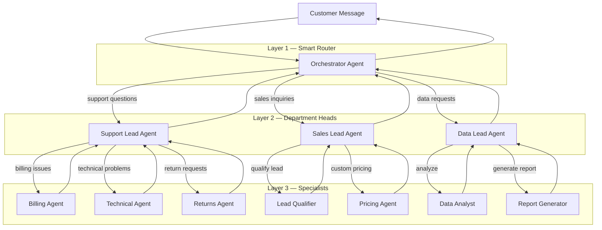

Real business problems are rarely simple enough for a single agent. A customer asks a question that requires checking inventory, looking up their order history, calculating a refund, and drafting a response -- all in one conversation. This is where DEHA ONE's orchestration shines.

## Why Orchestration Matters

Think about how a well-run company works. A customer calls, and a receptionist understands their need, then routes them to the right department. That department might consult with other teams, check systems, and coordinate a response. No single person does everything -- it is a **team effort**.

DEHA ONE lets you build AI systems that work the same way. Instead of one overloaded agent trying to do everything, you create **specialist agents** that are each excellent at one thing, then connect them with **orchestrator agents** that coordinate the team.

<Info>
  The result? Systems that are not just automated, but genuinely **intelligent** -- capable of handling complex, multi-step scenarios that would otherwise require a team of humans.
</Info>

---

## Unlimited Orchestration Layers

This is what makes DEHA ONE fundamentally different. There is **no limit** to how many layers of orchestration you can build. Agents can delegate to other agents, which can delegate to others, creating sophisticated decision-making hierarchies that mirror real organizational structures.

### What this means in practice

<CardGroup cols={2}>
  <Card title="Layer 1: Smart Routing" icon="brain">
    A top-level orchestrator understands the customer's intent and routes to the right department -- support, sales, data, or others.
  </Card>
  <Card title="Layer 2: Department Coordination" icon="users">
    Each department lead agent manages its own team of specialists, deciding which one is best suited for the specific request.
  </Card>
  <Card title="Layer 3: Deep Specialization" icon="bullseye">
    Specialist agents focus on one thing and do it exceptionally well -- billing calculations, technical troubleshooting, data analysis, etc.
  </Card>
  <Card title="Layer N: No Limits" icon="infinity">
    Specialists can delegate further. A data analyst can call a code execution agent for complex calculations, which can call an API integration for live data. There is no artificial limit.
  </Card>
</CardGroup>

<Tip>
  Each agent in the hierarchy can have its own AI model, tools, knowledge base, and personality. Use powerful models for complex reasoning at the top, and fast, efficient models for specialized tasks at the bottom.
</Tip>

---

## Building an Orchestrated System

### The easy way: Ask DEHA

The fastest way to set up multi-agent orchestration is through DEHA:

> **You:** "Create a customer support system with a smart router that delegates to three specialist agents: a billing agent for payment questions, a technical support agent for product issues, and a returns agent for refund requests."

DEHA will create all four agents with proper delegation rules, prompts, and routing logic -- ready to deploy.

### How delegation works

From the customer's perspective, they are talking to one seamless assistant. Behind the scenes:

<Steps>
  <Step title="Customer sends a message">
    "I want to return my order #12345 and get a refund"
  </Step>
  <Step title="Orchestrator analyzes intent">
    The orchestrator agent understands this is a return/refund request and decides to delegate to the Returns specialist.
  </Step>
  <Step title="Specialist handles the task">
    The Returns agent looks up order #12345, checks the return policy, processes the return, and calculates the refund amount.
  </Step>
  <Step title="Response flows back">
    The specialist's response flows back through the orchestrator to the customer. The customer never knows multiple agents were involved.
  </Step>
</Steps>

---

## Real-World Orchestration Patterns

<AccordionGroup>
  <Accordion title="Customer Service Hub" icon="headset">
    A central orchestrator routes incoming messages to specialized agents based on intent:

    - **General inquiries** → Knowledge base agent (answers from your docs)
    - **Order status** → Order tracking agent (checks your systems)
    - **Complaints** → Priority support agent (handles with care)
    - **Technical issues** → Technical support agent (troubleshoots)
    - **Billing questions** → Billing agent (checks account, processes payments)

    Each specialist has access to different tools and knowledge bases, making them highly effective at their specific job.
  </Accordion>

  <Accordion title="Data Intelligence Pipeline" icon="chart-mixed">
    An analytics orchestrator coordinates data agents:

    1. **Data Collector** pulls data from your connected sources
    2. **Data Cleaner** normalizes and validates the data
    3. **Analyst** runs statistical analysis and detects patterns
    4. **Report Generator** creates a readable summary with insights

    The orchestrator chains these agents together, passing results from one to the next.
  </Accordion>

  <Accordion title="Quality-Assured Responses" icon="shield-check">
    A two-layer system where every response is checked before sending:

    1. **Response Agent** drafts a reply to the customer
    2. **Judge Agent** evaluates the response for accuracy, tone, and compliance
    3. If the judge approves → response is sent
    4. If the judge flags issues → response is revised or escalated to a human

    This is essential for regulated industries, healthcare, finance, or any scenario where accuracy matters.
  </Accordion>

  <Accordion title="Multi-Channel Command Center" icon="tower-broadcast">
    Different channels route to different orchestration trees:

    - **WhatsApp** → Fast, concise responses via mobile-optimized agents
    - **Email** → Detailed, formal responses via email-specialized agents
    - **Web Chat** → Interactive agents with rich media support
    - **Internal Slack** → Employee-facing agents with access to internal systems

    All sharing the same specialist agents at the bottom, but with channel-appropriate orchestrators at the top.
  </Accordion>
</AccordionGroup>

---

## Handoff to Humans

When an AI agent reaches the limits of what it can handle, it seamlessly transfers the conversation to a human team member.

- The customer sees a smooth transition: "I'm connecting you with a specialist."
- The human agent receives the **full conversation history** and context
- When the human is done, the AI can resume handling future messages
- Handoffs can be configured per role, per topic, or per urgency level

---

## Why Unlimited Layers Matter

Most AI platforms limit you to simple chatbots or single-agent setups. DEHA ONE's unlimited orchestration layers let you build systems that are genuinely **intelligent**:

| Simple Chatbot | DEHA ONE Orchestration |
|---|---|
| One agent tries to do everything | Specialized agents excel at specific tasks |
| Generic responses | Deep, contextual answers using the right tools |
| Fails on complex requests | Decomposes complex requests across agent teams |
| No quality control | Judge agents and human review gates at every level |
| Single channel | Same orchestration works across all channels |
| Hard to scale | Add new specialists without changing existing agents |

<Warning>
  **Best practice:** Keep each agent focused on one responsibility. An agent that tries to do too many things becomes harder to maintain and less effective. It is better to have 10 specialized agents coordinated by an orchestrator than one agent with 50 tools.
</Warning>

---

## Explore Further

<CardGroup cols={2}>
  <Card title="Creating Agents" icon="plus" href="/agents/creating-agents">
    Learn how to create agents via DEHA or the dashboard.
  </Card>
  <Card title="Tools & Integrations" icon="plug" href="/agents/tools-and-integrations">
    Give your agents access to APIs, databases, and more.
  </Card>
  <Card title="Human Review" icon="user-check" href="/automations/human-review">
    Add approval gates for quality-critical workflows.
  </Card>
  <Card title="Automations" icon="wand-magic-sparkles" href="/automations/overview">
    Coordinate agents with multi-step automated workflows.
  </Card>
</CardGroup>
