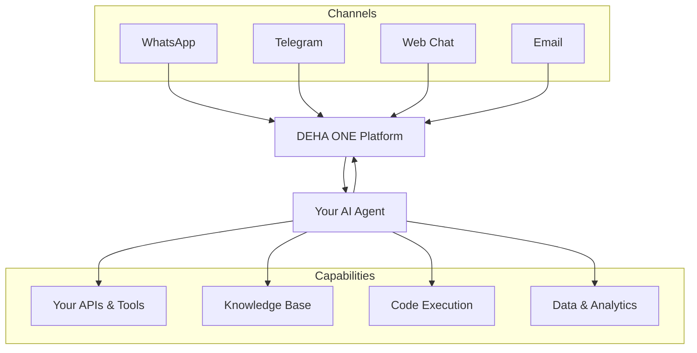

AI agents are the core of what makes DEHA ONE powerful. An agent is an intelligent assistant that can hold conversations, use tools, search knowledge bases, make decisions, and even delegate work to other agents. You deploy them to WhatsApp, Telegram, Email, or your website, and they start working for you immediately.

---

## What can agents do?

<CardGroup cols={2}>
  <Card title="Talk to your customers" icon="comments">
    Agents hold natural, multi-turn conversations across WhatsApp, Telegram, Email, and Web. They remember context within a session and respond in your customer's language.
  </Card>
  <Card title="Use your tools and APIs" icon="wrench">
    Agents can look up data in your CRM, check order status, process returns, search databases, execute calculations, and call any REST API you connect.
  </Card>
  <Card title="Search your knowledge base" icon="book-open">
    Upload product docs, FAQs, or policy documents, and agents will search them to give accurate, grounded answers instead of guessing.
  </Card>
  <Card title="Make smart decisions" icon="code-branch">
    Agents can classify requests, route conversations, detect sentiment, and take different actions based on what they discover.
  </Card>
  <Card title="Escalate to humans" icon="user-check">
    When an agent reaches the limits of what it can handle, it seamlessly transfers the conversation to a human team member with full context preserved.
  </Card>
  <Card title="Work as a team" icon="sitemap">
    Multiple agents can collaborate. A smart router delegates customer requests to specialized agents -- billing, technical support, sales -- without the customer noticing the handoff.
  </Card>
</CardGroup>

---

## Types of agents

DEHA ONE supports three types of agents, each designed for different use cases.

<Tabs>
  <Tab title="Conversation agents">
    **Best for:** Customer support, sales, onboarding, Q&A

    Conversation agents interact with users in real-time. They maintain a running conversation history, remember what was discussed, and can handle complex multi-step interactions.

    **Examples:**
    - Customer support bot that answers questions and looks up orders
    - Sales assistant that qualifies leads and books meetings
    - Onboarding agent that guides new users through setup

  </Tab>
  <Tab title="Processor agents">
    **Best for:** Data analysis, content generation, document processing

    Processor agents handle one-off tasks. They receive an input, do their job, and return a structured result. They do not maintain conversation history between runs.

    **Examples:**
    - Feedback analyzer that categorizes customer reviews
    - Report generator that summarizes daily sales data
    - Document classifier that tags incoming support tickets

  </Tab>
  <Tab title="Judge agents">
    **Best for:** Quality control, content review, compliance checking

    Judge agents evaluate the output of other agents. They score responses for quality, accuracy, and appropriateness, then decide whether to approve, request revisions, or escalate to a human reviewer.

    **Examples:**
    - Quality gate that reviews agent responses before they reach customers
    - Compliance checker for regulated industries
    - Content moderator for user-generated messages

  </Tab>
</Tabs>

---

## How agents work

From your perspective, the process is straightforward:

<Steps>
  <Step title="Create an agent">
    Use DEHA to describe the agent you want, or configure it through the dashboard. Specify its personality, capabilities, and the channels it should serve.
  </Step>
  <Step title="Connect tools and knowledge">
    Give your agent access to the tools it needs -- APIs, databases, knowledge bases, code execution. The more tools it has, the more it can do.
  </Step>
  <Step title="Deploy to channels">
    Connect your agent to WhatsApp, Telegram, Email, or your website. It starts responding to messages immediately.
  </Step>
  <Step title="Messages flow in">
    When a customer sends a message, the platform routes it to the right agent based on your routing rules.
  </Step>
  <Step title="Agent responds">
    The agent processes the message, uses tools if needed, searches knowledge if relevant, and sends back a response -- all in seconds.
  </Step>
</Steps>

---

## Key capabilities

### Multi-channel deployment

Deploy the same agent across multiple channels. Your customers get a consistent experience whether they message on WhatsApp, Telegram, Email, or your website.

### AI model flexibility

Choose the AI model that best fits each agent's needs. Use more powerful models for complex reasoning tasks and faster models for simple Q&A. Switch models at any time without rebuilding your agent.

### Human-in-the-loop

Add approval steps where a human team member reviews the agent's response before it is sent. You can set this up for all responses or only for sensitive topics like refunds, legal questions, or escalations.

### Quality gates

Use judge agents to automatically evaluate response quality. Set thresholds for automatic approval, revision requests, or human escalation. This lets you maintain quality standards at scale.

### Traffic routing and A/B testing

Run multiple versions of an agent simultaneously with weighted traffic distribution. Test a new agent version with 10% of traffic before rolling it out to everyone.

### Unlimited orchestration layers

Build truly intelligent systems by connecting agents into hierarchies. An orchestrator agent routes requests to specialists, which can delegate to sub-specialists, with no limit on how deep the hierarchy goes. This lets you create AI systems that mirror real team structures -- from a smart receptionist routing calls, to department leads managing specialists, to experts handling specific tasks.

<Card title="Learn more about orchestration" icon="sitemap" href="/agents/multi-agent-orchestration">
  Discover how unlimited orchestration layers let you build systems that are genuinely intelligent -- not just automated.
</Card>

### Live updates

Update your agent's behavior, tools, or personality without any downtime. Changes take effect immediately for new conversations.

---

## Architecture overview

---

## Explore further

<CardGroup cols={2}>
  <Card title="Creating Agents" icon="plus" href="/agents/creating-agents">
    Step-by-step guide to creating and configuring agents.
  </Card>
  <Card title="Tools & Integrations" icon="plug" href="/agents/tools-and-integrations">
    What tools agents can use and how to connect them.
  </Card>
  <Card title="Node Types" icon="shapes" href="/agents/node-types">
    All the building blocks available for agent workflows.
  </Card>
  <Card title="Multi-Agent Orchestration" icon="sitemap" href="/agents/multi-agent-orchestration">
    Coordinate teams of agents that work together.
  </Card>
</CardGroup>
