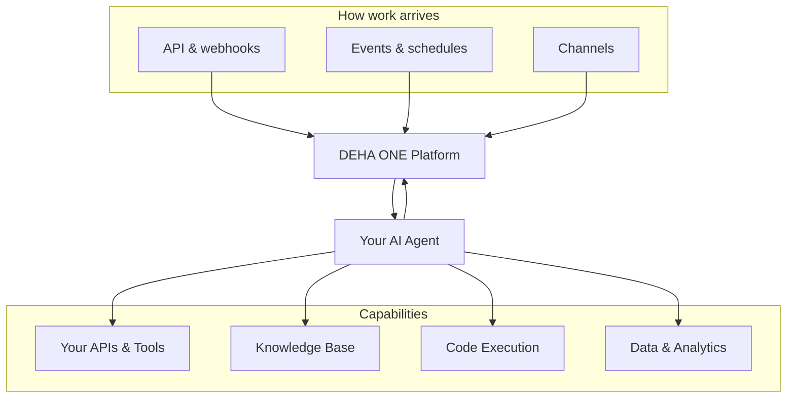

AI agents are the core of what makes DEHA ONE powerful, and they are **not chatbots**. An agent plans, uses real tools, queries your data, runs code, works proactively, and hands off to other agents to get actual work done. It can hold a conversation when that's useful, but conversation is just one of the things it does.

---

## What can agents do?

<CardGroup cols={2}>
  <Card title="Use your tools and APIs" icon="wrench">
    Look up data in your systems, check status, process records, run calculations, and call any REST API you connect, as real actions, not just replies.
  </Card>
  <Card title="Work with your data" icon="database">
    Query your data in plain language, profile it, forecast, detect anomalies, and reason over your [living data map](/idrak/overview).
  </Card>
  <Card title="Work proactively" icon="bolt">
    Agents can schedule themselves and watch for events, so they act before you ask, not only when prompted.
  </Card>
  <Card title="Make smart decisions" icon="code-branch">
    Classify, route, branch, and take different actions based on what they discover, with deterministic, checkable outputs.
  </Card>
  <Card title="Run code safely" icon="code">
    Write and run Python in a secure sandbox for precise computation, data processing, and custom logic.
  </Card>
  <Card title="Work as a team" icon="sitemap">
    Agents delegate to specialist agents and coordinate, the way a capable team would, with you able to approve sensitive steps.
  </Card>
</CardGroup>

---

## Types of agents

DEHA ONE supports three types of agents, each for different work.

<Tabs>
  <Tab title="Task agents">
    **Best for:** automation, data work, content generation, document processing

    Task agents do a job. They receive an input, plan, use tools, and return a structured result, ideal as steps inside your automations.

    **Examples:**
    - Feedback analyzer that categorizes and scores reviews
    - Report generator that summarizes daily sales data
    - Document classifier that tags incoming files

  </Tab>
  <Tab title="Interactive agents">
    **Best for:** Q&A over your data, internal helpers, guided workflows

    Interactive agents maintain context across a back-and-forth. They remember what was discussed and can handle complex, multi-step requests, when a conversation is the right interface.

    **Examples:**
    - An analyst you can ask questions about your data
    - An internal helper that runs reports and looks things up
    - A guided workflow that collects input and acts on it

  </Tab>
  <Tab title="Judge agents">
    **Best for:** quality control, content review, compliance checking

    Judge agents evaluate the output of other agents. They score results for quality, accuracy, and appropriateness, then approve, request revisions, or escalate to a human.

    **Examples:**
    - Quality gate that reviews output before it ships
    - Compliance checker for regulated industries
    - Content moderator for generated text

  </Tab>
</Tabs>

---

## How agents work

From your perspective, the process is straightforward:

<Steps>
  <Step title="Create an agent">
    Use DEHA to describe the agent you want, or configure it through the dashboard. Specify what it should do and which tools and data it can use.
  </Step>
  <Step title="Connect tools and knowledge">
    Give your agent access to the tools it needs, APIs, databases, knowledge, code execution. The more tools it has, the more it can do.
  </Step>
  <Step title="Put it to work">
    Run the agent as a step in an automation, expose it as an API, or trigger it on a schedule or an event.
  </Step>
  <Step title="A request comes in">
    When work arrives, an API call, an event, or a message, the platform routes it to the right agent based on your rules.
  </Step>
  <Step title="Agent acts">
    The agent plans, uses tools, runs code, and produces a result, in seconds, with full traceability.
  </Step>
</Steps>

---

## Key capabilities

### AI model flexibility

Choose the AI model that best fits each agent's needs. Use more powerful models for complex reasoning and faster models for simple tasks. Switch models at any time without rebuilding your agent.

### Human-in-the-loop

Add approval steps where a person reviews an action before it happens. Set it up for everything, or only for sensitive operations.

### Quality gates

Use judge agents to automatically evaluate output quality. Set thresholds for automatic approval, revision, or human escalation, so you maintain standards at scale.

### Traffic routing and A/B testing

Run multiple versions of an agent at once with weighted traffic. Test a new version with a small share before rolling it out.

### Unlimited orchestration layers

Build genuinely intelligent systems by connecting agents into hierarchies. An orchestrator routes work to specialists, which can delegate to sub-specialists, with no limit on depth, mirroring how real teams are structured.

<Card title="Learn more about orchestration" icon="sitemap" href="/agents/multi-agent-orchestration">
  Discover how unlimited orchestration layers let you build systems that are genuinely intelligent, not just automated.
</Card>

### Live updates

Update an agent's behavior or tools without downtime. Changes take effect immediately.

---

## Architecture overview

```mermaid
flowchart TB
    subgraph Inputs["How work arrives"]
        API[API & webhooks]
        EVENT[Events & schedules]
        CH[Channels]
    end

    PLATFORM[DEHA ONE Platform]
    AGENT[Your AI Agent]

    subgraph Capabilities
        TOOLS[Your APIs & Tools]
        KB[Knowledge Base]
        CODE[Code Execution]
        DATA[Data & Analytics]
    end

    API --> PLATFORM
    EVENT --> PLATFORM
    CH --> PLATFORM
    PLATFORM --> AGENT
    AGENT --> TOOLS
    AGENT --> KB
    AGENT --> CODE
    AGENT --> DATA
    AGENT --> PLATFORM
```

---

## Explore further

<CardGroup cols={2}>
  <Card title="Creating Agents" icon="plus" href="/agents/creating-agents">
    Step-by-step guide to creating and configuring agents.
  </Card>
  <Card title="Tools & Integrations" icon="plug" href="/agents/tools-and-integrations">
    What tools agents can use and how to connect them.
  </Card>
  <Card title="Building Blocks" icon="shapes" href="/agents/building-blocks">
    All the building blocks available for agent workflows.
  </Card>
  <Card title="Multi-Agent Orchestration" icon="sitemap" href="/agents/multi-agent-orchestration">
    Coordinate teams of agents that work together.
  </Card>
</CardGroup>
