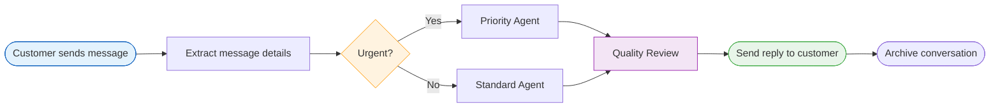

Automations (also called **pipelines** in the platform) are multi-step workflows that run automatically when something happens in your workspace. They connect AI agents, channels, data sources, optimization, web search, IoT, and business logic into repeatable processes that work around the clock.

Instead of manually handling every incoming message or running reports by hand, you define an automation once and let DEHA ONE take care of the rest.

<Info>
  **Pipeline-First architecture**: every automation is also a callable endpoint. Once deployed, your pipeline becomes accessible via REST API (with its own API key, rate limit, and OpenAPI spec) and can be invoked from any agent, any other pipeline, or any external system. See [Dynamic API](/api-reference/dynamic-api-overview).
</Info>

<Info>
  Automations are **durable**. Failures, restarts, and timeouts are handled with checkpoints and saga compensation — side-effect steps (REST writes, data loads, publishes, IoT commands) can be reversed if the pipeline aborts mid-flight.
</Info>

---

## What can you automate?

<CardGroup cols={2}>
  <Card title="Message Routing" icon="route">
    Automatically direct incoming WhatsApp, Telegram, or web messages to the right AI agent based on content, urgency, or customer type.
  </Card>
  <Card title="Scheduled Reports" icon="calendar-check">
    Generate daily sales summaries, weekly analytics, or monthly performance reports and deliver them to your team.
  </Card>
  <Card title="Data Processing" icon="gears">
    Pull data from external systems, clean and transform it, run quality checks, and push it back -- all on autopilot.
  </Card>
  <Card title="Quality Assurance" icon="shield-check">
    Review AI-generated responses before they reach customers. Add approval gates for sensitive operations.
  </Card>
  <Card title="Customer Workflows" icon="users">
    Onboard new customers, handle support tickets, escalate complaints, and follow up -- triggered by a single message.
  </Card>
  <Card title="Data Sync" icon="arrows-rotate">
    Keep your CRM, databases, and knowledge base in sync with scheduled data imports and exports.
  </Card>
</CardGroup>

---

## How automations work

Every automation follows a simple pattern: a trigger starts it, steps do the work, and results are delivered where you need them.

<Steps>
  <Step title="Something triggers the automation">
    A new message arrives, a scheduled time is reached, or you trigger it manually from the dashboard or API.
  </Step>
  <Step title="Steps run in sequence">
    Each step performs one action -- calling an AI agent, transforming data, checking a condition, or sending a message. Results from one step flow into the next.
  </Step>
  <Step title="Decisions are made along the way">
    Condition steps can branch the workflow based on message content, data values, or AI-powered classification. Different situations get handled differently.
  </Step>
  <Step title="Results are delivered">
    The final steps send responses to customers, update your dashboard, archive records, or push data to external systems.
  </Step>
</Steps>

---

## Triggers

Every automation starts with a trigger -- the event that kicks off the workflow. Triggers can have **conditions** attached (e.g., only fire if the result of a SQL check is above a threshold).

| Trigger | Description | Example |
| --- | --- | --- |
| **Cron** | A specific time or recurring interval | Every weekday at 9 AM |
| **Interval** | Fixed-period repetition | Every 5 minutes |
| **Date** | One-shot at a specific datetime | At 2026-06-01 14:00 UTC |
| **Event** | Match on any Redis Stream event (CloudEvent format) | A new IoT telemetry frame from sensor X |
| **Data change** | Hash / row-count / percentage change on a SQL query | When the `orders` table grows by >5% |
| **Threshold** | A SQL query crosses a numeric threshold | When daily revenue exceeds 100K |
| **Webhook** | An external system POSTs to a signed URL | Stripe payment-succeeded event |
| **Composite** | AND / OR / SEQUENCE of sub-triggers | Webhook AND daily 9am cron |
| **Manual / API** | Direct invocation from dashboard, agent, or REST | Running a one-time data cleanup |

Conditions you can attach to any trigger:

- `always` — unconditional
- `sql` — a SQL query that returns boolean / number
- `threshold` — SQL value above / below a threshold
- `llm` — an LLM yes/no decision
- `composite` — AND / OR / NOT of other conditions
- `data_changed` — change-detection on a SQL query
- `time_window` — only fire during certain hours / weekdays

---

## Example: Customer support automation

Here is what a typical customer support automation looks like:

This automation:
1. Receives a customer message from WhatsApp
2. Extracts the message content and customer details
3. Checks if the message contains urgent keywords
4. Routes to the appropriate AI agent (priority or standard)
5. Reviews the agent's response for quality
6. Sends the approved reply back to the customer
7. Archives the conversation for future reference

All of this happens in seconds, without anyone on your team needing to intervene.

---

## Automations vs. agents

Automations and AI agents work together, but they serve different purposes.

| | Automation | AI Agent |
| --- | --- | --- |
| **What it does** | Follows a defined sequence of steps | Thinks and decides what to do next |
| **Best for** | Predictable workflows with known steps | Open-ended conversations and reasoning |
| **Decisions** | You define the branching rules | The AI decides dynamically |
| **Typical role** | The overall workflow coordinator | A step within the workflow |

<Tip>
The most powerful pattern is to use an **automation as the overall workflow** and call **AI agents as individual steps** within it. The automation handles the structure, routing, and quality checks, while agents handle the thinking.
</Tip>

---

## Get started

<CardGroup cols={2}>
  <Card title="Create an Automation" icon="plus" href="/automations/creating-automations">
    Learn how to build your first automation step by step.
  </Card>
  <Card title="Step Types" icon="list-check" href="/automations/step-types">
    Explore all the actions you can include in your automations.
  </Card>
  <Card title="Scheduling" icon="clock" href="/automations/scheduling">
    Set up time-based automations that run on a schedule.
  </Card>
  <Card title="Human Review" icon="user-check" href="/automations/human-review">
    Add approval gates to keep humans in the loop.
  </Card>
</CardGroup>
