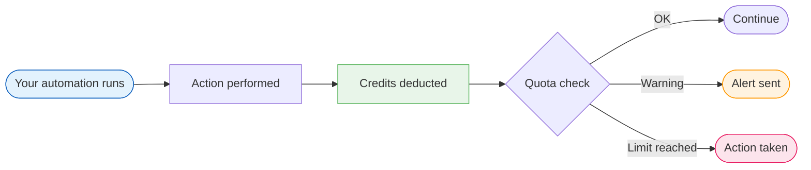

DEHA ONE uses a simple credit-based billing system. Every action the platform performs on your behalf -- generating an AI response, sending a message, running a query, executing code -- costs a small number of credits. You start each month with a credit allowance based on your plan, and the platform tracks your usage in real time.

---

## How credits work

Credits are the universal currency of the platform. Instead of tracking dozens of different usage metrics, everything is measured in credits. This makes it easy to understand your spending at a glance.

---

## What costs credits

| Action | Typical cost | Examples |
| --- | --- | --- |
| **AI responses** | Varies by model + tokens | Agent replies, content generation, classification, summarization |
| **Messages sent** | 1 credit | WhatsApp, Telegram, Slack, or email outbound messages |
| **Sandboxed code** | 2 credits per successful run | Python execution in standard / data / ml profiles |
| **SQL queries** | 1 credit (direct), 3 credits (text-to-SQL) | Includes cost-estimation pass |
| **Data operations** | 1-5 credits | Transform, profile, validate, dedup, PII detect, snapshot |
| **Connectors** | 3 base + 1 per 1K records | Extract from REST, DB, file, SFTP, webhook |
| **Analytics** | 2-8 credits per task | Forecasting, anomaly, classification, regression, drift |
| **Document ingestion** | 10 credits per document | Knowledge-base parsing + embedding |
| **Semantic search** | 1 credit | Knowledge-base vector + rerank query |
| **Web search** | 3 credits per query | 13-provider parallel fan-out + dedup + rerank |
| **Web scraping** | 2 / 5 / 10 credits per URL | Markdown / CSS / LLM extraction |
| **Optimization** | 3-8 credits per solve | LP/MIP/VRP/scheduling/assignment/packing/network flow |
| **Schedule trigger** | 1 credit per fire + 1 per condition | Cron, interval, event, data-change, threshold, webhook |
| **REST / MCP tool calls** | 1 credit per call | Charged on success; failed calls are not billed |
| **IoT command** | 1 credit per accepted command | MQTT / OPC-UA / Modbus dispatch |

<Info>
AI response costs depend on the model used and the number of tokens. More capable models cost more credits per request. You can control costs by using semantic aliases (`fast` / `smart` / `cheap` / `reasoning`) per agent and per call -- use faster, lighter models for simple tasks and reserve powerful models for complex reasoning. BYOK (bring your own LLM keys) reduces platform LLM costs to zero -- you pay your provider directly.
</Info>

---

## Viewing your usage

Your dashboard gives you a clear picture of your credit consumption:

- **Current month usage** -- a progress bar showing how much of your monthly allowance you have used
- **Daily trends** -- a chart showing your day-by-day consumption patterns
- **Breakdown by type** -- see which actions are consuming the most credits (AI responses, messages, queries, etc.)
- **Historical comparison** -- compare usage across months to spot trends

---

## Usage alerts

The platform automatically notifies you as you approach your monthly limit:

<Steps>
  <Step title="Normal usage">
    Everything is running smoothly. No alerts.
  </Step>
  <Step title="Warning threshold reached">
    When you reach a percentage of your monthly limit (default: 80%), you receive a dashboard notification letting you know usage is getting high. This gives you time to adjust before hitting the limit.
  </Step>
  <Step title="Monthly limit reached">
    When you hit 100% of your limit, the platform takes the action configured for your account (see [Credits & Quotas](/billing/credits-and-quotas)).
  </Step>
</Steps>

---

## Billing plans

DEHA ONE offers plans for different usage levels:

| Plan | Monthly credits | Best for |
| --- | --- | --- |
| **Startup** | 50,000 | Small teams getting started |
| **Growth** | 200,000 | Growing businesses with moderate usage |
| **Enterprise** | 500,000+ | Large organizations with high-volume needs |

Enterprise plans include volume discounts, custom credit limits, and dedicated support. Contact your account representative for custom pricing.

---

## Bring Your Own API Keys (BYOK)

If you have your own API keys for LLM and embedding providers (OpenAI, Anthropic, Google Vertex AI with your GCP service account, Google Gemini, DeepSeek, etc.), you can connect them to DEHA ONE.

- **Platform credit cost drops to zero** for those calls — you pay your provider directly
- Use your **own provider rate limits** and quotas
- Keep your **own billing relationship** with each provider
- BYOK is per-user: different users can use different keys

Embedding BYOK works the same way — point a collection at your own embedding provider, and ingestion / search consume zero platform credits.

This is a great option for teams that already have AI provider relationships, need specific provider compliance, or want to maximize their DEHA ONE credits for non-AI operations.

---

## Next steps

<CardGroup cols={2}>
  <Card title="Credits & Quotas" icon="gauge-high" href="/billing/credits-and-quotas">
    Set spending limits, configure alerts, and understand what happens when you reach your quota.
  </Card>
  <Card title="Automations" icon="wand-magic-sparkles" href="/automations/overview">
    Learn about the automations that consume credits.
  </Card>
</CardGroup>
