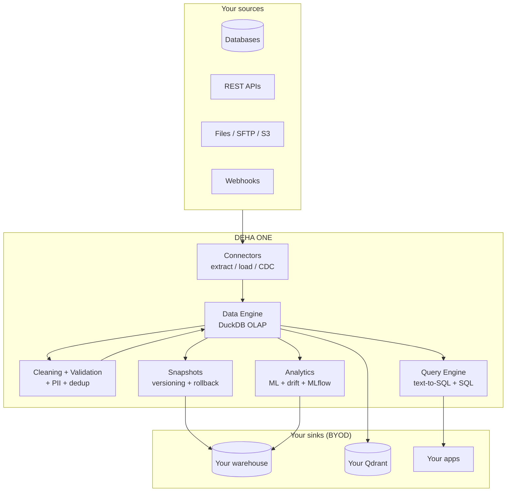

DEHA ONE turns your data into something agents and humans can actually work with. Connect a source, define what "good data" means, and the platform handles ingest, cleaning, validation, querying, analysis, privacy, and versioning.

<Info>
  **Bring Your Own Data (BYOD)**: the platform processes your data but does not own it. Operational state stays in DEHA ONE; business data is sunk back to your warehouse — PostgreSQL, MySQL, MongoDB, S3, or external Qdrant. Hybrid setups are supported.
</Info>

---

## What you can do

<CardGroup cols={2}>
  <Card title="Connect data" icon="plug" href="/data/connecting-data">
    Pull from REST APIs, PostgreSQL / MySQL / MSSQL / Oracle / SQLite, MongoDB, SFTP, files (CSV, Excel, JSON, JSONL, Parquet), and webhooks.
  </Card>
  <Card title="Ask in plain English" icon="comments" href="/data/querying-data">
    Text-to-SQL converts your question into a safe, optimized query and explains the results. Power users can hand-write SQL.
  </Card>
  <Card title="Run analytics" icon="chart-mixed" href="/data/analytics">
    Forecasting, anomaly detection, clustering, classification, regression, survival, drift -- with auto-engine selection.
  </Card>
  <Card title="Transform data" icon="wand-magic-sparkles" href="/data/transformations">
    YAML-driven pipelines: extract, map, template, cast, filter, merge, split. AI-assisted mapping for fuzzy fields.
  </Card>
  <Card title="Clean & validate" icon="broom" href="/data/data-quality">
    12 cleaning operations, schema validation, deduplication (Splink-powered), and synthetic data generation.
  </Card>
  <Card title="Protect privacy" icon="shield-halved" href="/data/privacy-and-pii">
    Detect PII with Microsoft Presidio (incl. Turkish recognizers) and anonymize with replace / redact / hash / mask / encrypt.
  </Card>
  <Card title="Version & rollback" icon="clock-rotate-left" href="/data/versioning-and-byod">
    Delta Lake snapshots with time-travel and rollback. Route results to your warehouse via BYOD.
  </Card>
  <Card title="Track drift" icon="chart-line" href="/guides/forecast-and-drift">
    Evidently-powered drift detection on inputs and predictions. Severity-graded HTML reports.
  </Card>
</CardGroup>

---

## How it works

Every step is composable. You can pull from a CRM, clean it, scrub PII, forecast, version the snapshot, and push the result back to your warehouse — all in one pipeline.

---

## Per-user isolation

Every organization gets:

- Its own per-user **DuckDB** database (file-isolated, read-only for analytics / query workloads)
- Its own **schemas** (versioned via Config Service)
- Its own **vault** for credentials
- Its own **MLflow** registry namespace
- Its own **vector collections** in Qdrant (or BYOD to your own Qdrant)
- Its own **lineage** namespace in Marquez

Cross-user access is structurally impossible — every layer enforces the user ID.

---

## Where AI fits in

- **Text-to-SQL** lets non-technical users ask "Show me churn-risk customers from Q3" without knowing SQL
- **Schema mapping suggestions** propose field-to-field mappings during data onboarding
- **PII detection** uses Presidio + LLM augmentation to find sensitive fields beyond simple regex
- **Auto engine selection** picks TabPFN for small datasets (under 10K rows) and LightGBM for larger ones
- **Forecasting** auto-selects between StatsForecast, Prophet, and NeuralForecast based on the series
- **Drift detection** uses PSI, K-S, Jensen-Shannon, and Wasserstein with severity grading
- **Result explanations** turn a SQL query result into a plain-English summary your team can read

---

## Common workflows

<AccordionGroup>
  <Accordion title="Build a self-serve analytics assistant">
    Connect your warehouse, define schemas, train Text-to-SQL on a few example questions, and deploy an agent that answers "how many X" questions in WhatsApp or Slack.
  </Accordion>
  <Accordion title="Daily anomaly digest">
    Schedule a pipeline that pulls yesterday's transactions, runs IsolationForest anomaly detection, renders a chart, and posts the top anomalies to a Slack channel.
  </Accordion>
  <Accordion title="GDPR / KVKK compliant export">
    On user request, scan all users' tables for PII, anonymize with Presidio, package the result, and email the customer their compliant data extract.
  </Accordion>
  <Accordion title="ML-driven dynamic pricing">
    Forecast next-week demand, segment customers via clustering, predict willingness-to-pay with regression, and push optimal prices back to your ERP — all on a weekly schedule.
  </Accordion>
  <Accordion title="Time-travel debugging">
    When a downstream report looks wrong, roll the snapshot back to last Tuesday, re-run, and diff — no DBA tickets, no restoring from backups.
  </Accordion>
</AccordionGroup>

---

## Getting started

1. **[Connect a data source](/data/connecting-data)** — pull your first dataset.
2. **[Ask questions](/data/querying-data)** — explore with natural language.
3. **[Set up data quality](/data/data-quality)** — clean, validate, dedup.
4. **[Scrub PII](/data/privacy-and-pii)** — detect and anonymize.
5. **[Run analytics](/data/analytics)** — forecast, anomaly, classify, cluster.
6. **[Version snapshots](/data/versioning-and-byod)** — Delta Lake + BYOD sink.
