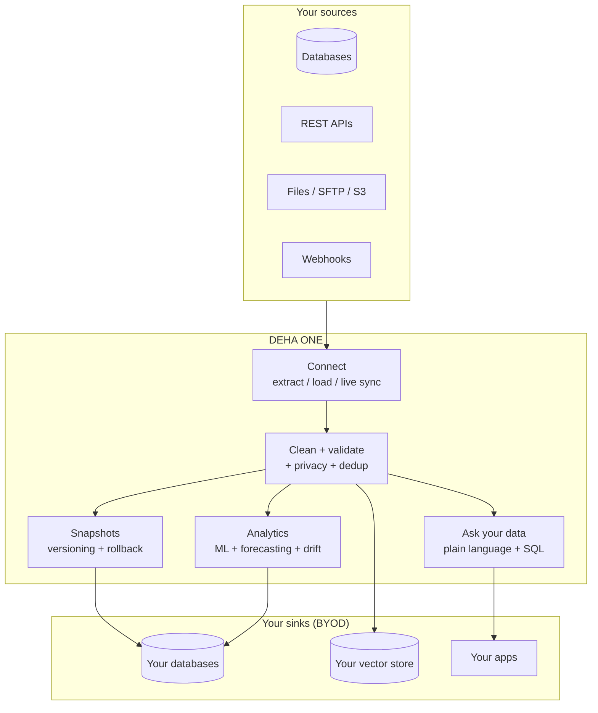

DEHA ONE turns your data into something agents and humans can actually work with. Connect a source, define what "good data" means, and the platform handles ingest, cleaning, validation, querying, analysis, privacy, and versioning.

<Info>
  **Bring Your Own Data (BYOD)**: the platform processes your data but does not own it. Operational state stays in DEHA ONE; business data is sunk back to your own systems — PostgreSQL, MySQL, MongoDB, S3, or your own vector store. Hybrid setups are supported.
</Info>

<Tip>
  Want one connected picture of *everything* you've loaded -- and the ability to ask questions across it? That's [İDRAK, your living data map](/idrak/overview).
</Tip>

---

## What you can do

<CardGroup cols={2}>
  <Card title="Connect data" icon="plug" href="/data/connecting-data">
    Pull from REST APIs, PostgreSQL / MySQL / MSSQL / Oracle / SQLite, MongoDB, SFTP, files (CSV, Excel, JSON, JSONL, Parquet), and webhooks.
  </Card>
  <Card title="Ask in plain English" icon="comments" href="/data/querying-data">
    Ask a question in plain language and the platform turns it into a safe, optimized query and explains the results. Power users can hand-write SQL.
  </Card>
  <Card title="Run analytics" icon="chart-mixed" href="/data/analytics">
    Forecasting, anomaly detection, clustering, classification, regression, survival, and drift -- the best-fit model is chosen for you.
  </Card>
  <Card title="Transform data" icon="wand-magic-sparkles" href="/data/transformations">
    Composable pipelines: extract, map, template, cast, filter, merge, split -- with AI-assisted mapping for fuzzy fields.
  </Card>
  <Card title="Clean & validate" icon="broom" href="/data/data-quality">
    A full set of cleaning operations, schema validation, intelligent deduplication, and synthetic data generation.
  </Card>
  <Card title="Protect privacy" icon="shield-halved" href="/data/privacy-and-pii">
    Automatically detect personal data (PII) -- including Turkish and other languages -- and anonymize with replace / redact / hash / mask / encrypt.
  </Card>
  <Card title="Version & rollback" icon="clock-rotate-left" href="/data/versioning-and-byod">
    Versioned snapshots with time-travel and rollback. Route results to your own systems via BYOD.
  </Card>
  <Card title="Track drift" icon="chart-line" href="/guides/forecast-and-drift">
    Drift monitoring on inputs and predictions, with severity-graded reports.
  </Card>
</CardGroup>

---

## How it works

```mermaid
flowchart TB
    subgraph Sources["Your sources"]
        DB[(Databases)]
        API[REST APIs]
        Files[Files / SFTP / S3]
        Stream[Webhooks]
    end

    subgraph DEHA["DEHA ONE"]
        Connect[Connect<br/>extract / load / live sync]
        Quality[Clean + validate<br/>+ privacy + dedup]
        Ask[Ask your data<br/>plain language + SQL]
        Analytics[Analytics<br/>ML + forecasting + drift]
        Snapshot[Snapshots<br/>versioning + rollback]
    end

    subgraph Sinks["Your sinks (BYOD)"]
        Warehouse[(Your databases)]
        Vector[(Your vector store)]
        Apps[Your apps]
    end

    Sources --> Connect --> Quality --> Ask
    Quality --> Analytics
    Quality --> Snapshot
    Snapshot --> Warehouse
    Analytics --> Warehouse
    Ask --> Apps
    Quality --> Vector
```

Every step is composable. You can pull from a CRM, clean it, protect personal data, forecast, version the snapshot, and push the result back to your own database — all in one pipeline.

---

## Fully isolated, by design

Every workspace is completely isolated. Your data, your schemas, your credentials, your models, your knowledge, and your activity history are all separated at every layer -- cross-workspace access is structurally impossible. You stay in full control of where your data lives and who can reach it.

---

## Where AI fits in

- **Ask in plain language** lets non-technical users ask "Show me churn-risk customers from Q3" without knowing SQL.
- **Schema mapping suggestions** propose field-to-field mappings during data onboarding.
- **PII detection** finds sensitive fields well beyond simple pattern matching, across languages.
- **Automatic model selection** picks the best-fit model for your dataset and task -- no tuning required.
- **Forecasting** automatically chooses the right method for your time series.
- **Drift detection** uses established statistical methods with clear severity grading.
- **Result explanations** turn a query result into a plain-English summary your team can read.

---

## Common workflows

<AccordionGroup>
  <Accordion title="Build a self-serve analytics assistant">
    Connect your warehouse, define schemas, teach the platform a few example questions, and deploy an agent that answers "how many X" questions in WhatsApp or Slack.
  </Accordion>
  <Accordion title="Daily anomaly digest">
    Schedule a pipeline that pulls yesterday's transactions, runs anomaly detection, renders a chart, and posts the top anomalies to a Slack channel.
  </Accordion>
  <Accordion title="GDPR / KVKK compliant export">
    On request, scan tables for personal data, anonymize it automatically, package the result, and email the customer their compliant data extract.
  </Accordion>
  <Accordion title="ML-driven dynamic pricing">
    Forecast next-week demand, segment customers via clustering, predict willingness-to-pay, and push optimal prices back to your systems — all on a weekly schedule.
  </Accordion>
  <Accordion title="Time-travel debugging">
    When a downstream report looks wrong, roll the snapshot back to last Tuesday, re-run, and diff — no DBA tickets, no restoring from backups.
  </Accordion>
</AccordionGroup>

---

## Getting started

1. **[Connect a data source](/data/connecting-data)** — pull your first dataset.
2. **[Ask questions](/data/querying-data)** — explore with natural language.
3. **[Set up data quality](/data/data-quality)** — clean, validate, dedup.
4. **[Protect personal data](/data/privacy-and-pii)** — detect and anonymize.
5. **[Run analytics](/data/analytics)** — forecast, anomaly, classify, cluster.
6. **[Version snapshots](/data/versioning-and-byod)** — time-travel + BYOD sink.
7. **[Map it all with İDRAK](/idrak/overview)** — one living map of everything you've connected.
