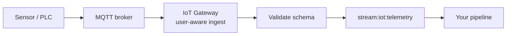

This guide takes you from "I have a sensor" to "my pipeline reacts when the sensor reports". We use MQTT as the example protocol, but the steps are identical for OPC-UA, Modbus, HTTP polling, and webhooks -- only the connection settings differ.

---

## What you will build



A single sensor reporting temperature and vibration to an MQTT broker, ingested by the platform, validated against a schema, and fed into a pipeline that posts to Slack when readings spike.

---

## Step 1 — Declare the connection

Connections are user-scoped. The simplest path is to ask DEHA:

> "Add an MQTT connection at `mqtts://broker.example.com:8883` named `factory-floor`. Auth with username `mqtt-user-a` and the password from `$vault:factory_mqtt_pwd`. Subscribe to topic `factory/+/telemetry`."

DEHA generates the YAML, vaults the password, and deploys it. The Gateway opens the MQTT connection live -- no restart.

The generated YAML looks roughly like:

```yaml
iot_connections:
  - name: factory-floor
    protocol: mqtt
    broker: "mqtts://broker.example.com:8883"
    username: "mqtt-user-a"
    password: $vault:factory_mqtt_pwd
    subscribe:
      - topic: "factory/+/telemetry"
        qos: 1
```

---

## Step 2 — Declare the device

Each device gets an ID, a schema, and operational settings:

```yaml
iot_devices:
  - id: cnc-line-3
    display_name: "CNC Line 3 - Spindle"
    connection: factory-floor
    tags: { factory: izmir, line: a3 }
    rate_limit_per_sec: 30
    heartbeat_seconds: 90
    schema:
      timestamp:      { type: datetime, required: true }
      temperature_c:  { type: float, required: true, min: -40, max: 200 }
      vibration_rms:  { type: float, required: true, min: 0 }
      spindle_rpm:    { type: integer, min: 0 }
```

Deploy this via DEHA or the dashboard. The device is now expected -- frames matching the schema flow in; frames that don't are tagged and routed to a DLQ.

---

## Step 3 — Verify ingest

In the dashboard:

1. **IoT → Devices** → `cnc-line-3`
2. Watch the live telemetry counter; the device should turn **online** as soon as the first valid frame arrives
3. If frames are coming in but failing schema, the **DLQ** tab will show why (missing required field, wrong type, out-of-range value)

Common gotchas:

- The MQTT topic is wrong (typo or wrong placeholder)
- The payload is binary (e.g., MessagePack) — set `body_codec: raw` and add a parsing step
- Timestamp format mismatch — the device sends Unix epoch, the schema expects ISO 8601 (or vice versa)

---

## Step 4 — React in a pipeline

Now build a pipeline that fires on a vibration spike:

```yaml
pipeline: vibration-spike-alert
trigger:
  type: event
  stream: stream:iot:telemetry
  filter: data.device_id == 'cnc-line-3' && data.vibration_rms > 6.0
  cooldown_seconds: 300

steps:
  - id: window
    type: data_query
    query: |
      SELECT timestamp, vibration_rms
      FROM iot_telemetry
      WHERE device_id = 'cnc-line-3'
        AND timestamp >= NOW() - INTERVAL '15 minutes'
      ORDER BY timestamp

  - id: anomaly
    type: analyze
    task: anomaly
    method: isolation_forest
    series: ${window.rows}

  - id: gate
    type: condition
    expression: "anomaly.is_anomaly"
    branches:
      "true": notify
      "false": __end__

  - id: notify
    type: publish
    channel: slack
    target: "#maintenance"
    text: |
      *Vibration anomaly on CNC Line 3 Spindle*
      Latest reading: ${trigger.data.vibration_rms} mm/s
      Anomaly score: ${anomaly.score}
```

Deploy. The next time vibration spikes and an anomaly is detected, a message lands in Slack -- with a 5-minute cooldown to avoid spam.

---

## Step 5 — Send commands back (optional)

For bidirectional protocols (MQTT, OPC-UA, Modbus), you can also send commands. A simple command step:

```yaml
- type: iot_command
  device_id: cnc-line-3
  action: publish
  topic: "factory/cnc-line-3/control"
  payload:
    set_max_rpm: 8000
  idempotency_key: "throttle-line-3-${trigger.window_id}"
```

The platform deduplicates by `idempotency_key`, so retries do not double-fire the actuator. The command result lands on `stream:iot:command:result`.

See [Commands & Control](/iot/commands-and-control) for the full safety story.

---

## Switching protocols

The flow is identical for the other protocols. Only the connection section changes:

| Protocol | Connection example |
|---|---|
| **OPC-UA** | `protocol: opcua`, `endpoint: opc.tcp://plc01.factory.lan:4840`, list of node IDs |
| **Modbus TCP** | `protocol: modbus_tcp`, `host`, `port`, register map with types |
| **HTTP polling** | `protocol: http_poll`, `url`, `method`, `interval_seconds` |
| **Inbound webhook** | `protocol: webhook`, `path`, `auth`, `body_codec` |

Everything else -- schemas, rate limits, heartbeats, pipelines -- works exactly the same.

---

## Operations tips

- **Use tags** (`factory: izmir`, `line: a3`) to filter dashboards and group devices in queries
- **Set rate limits per device** based on its actual reporting rate (with some headroom). A noisy sensor with a 1 Hz limit cannot DoS the platform.
- **Use heartbeat events** as pipeline triggers — pipelines that need to "react when a critical sensor goes silent" should listen to the `device.offline` event
- **Monitor the DLQ** in the IoT dashboard tab. If a device suddenly starts dumping into DLQ, the schema may have drifted (firmware change, hardware swap).
