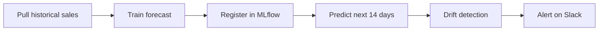

This guide walks you through a complete forecasting lifecycle: train a model, register it, run predictions on a schedule, and watch for drift over time.

---

## What you will build



A daily pipeline that:

1. Pulls yesterday's sales
2. Predicts the next 14 days using a registered forecast model
3. Compares predicted vs. actual for the prior 7 days
4. Computes drift across input features
5. Posts a chart-attached summary to Slack -- with severity-graded warnings

---

## Step 1 — Train a forecast model

The fastest path is to ask DEHA:

> "Train a daily revenue forecast from the `sales` table, target column `total`, time column `order_date`. Register the model as `revenue_forecast` in MLflow."

DEHA generates the pipeline, runs the training, and registers the model.

Or build it manually in the **Data Studio → Analytics**:

1. Select table `sales`
2. Task: **Forecasting**
3. Target column: `total`
4. Time column: `order_date`
5. Horizon: 14 days
6. **Train and register** as `revenue_forecast`

The platform auto-selects between **StatsForecast**, **Prophet**, and **NeuralForecast** based on the signal in your data.

---

## Step 2 — Promote to Production

After training, the model is in the **Staging** alias. Test predictions for a few days, then promote:

1. **MLflow** → `revenue_forecast` → version 1
2. **Promote to Production** (or any custom alias like `weekly_run`)

Multiple versions can coexist: one in production, one in staging being evaluated, one in development being trained.

---

## Step 3 — Run scheduled predictions

Set up a daily pipeline:

```yaml
pipeline: daily_revenue_forecast
trigger:
  type: cron
  expression: "0 7 * * *"
  timezone: Europe/Istanbul

steps:
  - id: history
    type: data_query
    query: |
      SELECT order_date, SUM(total) AS total
      FROM sales
      WHERE order_date >= CURRENT_DATE - INTERVAL '90 days'
      GROUP BY order_date
      ORDER BY order_date

  - id: predict
    type: analyze
    task: forecast
    model_name: revenue_forecast
    model_stage: Production
    series: ${history.rows}
    horizon: 14

  - id: render
    type: publish
    channel: slack
    target: "#sales-ops"
    text: "*14-day revenue forecast* (model: revenue_forecast@Production)"
    attachments:
      - chart_id: revenue-forecast-rolling
        format: png
```

The pipeline runs every morning at 7am and posts a chart to Slack.

---

## Step 4 — Add drift detection

Now monitor whether the model's inputs and outputs are shifting:

```yaml
- id: drift
  type: analyze
  task: drift
  reference: ${history.rows[-90:]}
  current:   ${history.rows[-14:]}
  metrics: [psi, ks, jensen_shannon, wasserstein]

- id: alert
  type: condition
  expression: "drift.severity in ['yellow', 'red']"
  branches:
    "true": notify_drift
    "false": __end__

- id: notify_drift
  type: publish
  channel: slack
  target: "#mlops"
  text: "*Drift detected on revenue_forecast*: severity `${drift.severity}`, PSI=${drift.psi}, K-S=${drift.ks}"
  attachments:
    - artifact_path: ${drift.evidently_report_html}
```

Severity grading:

- **Green** — within expected band, no action needed
- **Yellow** — small drift, may warrant attention
- **Red** — significant drift, likely time to retrain

The **Evidently HTML report** is attached for deep inspection.

---

## Step 5 — Retrain automatically

Tie drift back to retraining. When severity goes red, kick off retraining:

```yaml
- id: maybe_retrain
  type: condition
  expression: "drift.severity == 'red'"
  branches:
    "true": retrain_pipeline
    "false": __end__

- id: retrain_pipeline
  type: agent
  agent_name: mlops_supervisor
  input_mapping:
    reason: "Drift severity red on revenue_forecast"
    metrics: ${drift}
  wait_for_result: false
```

The MLOps agent will retrain, evaluate, and promote a new model version -- with a human approval gate before swapping the production alias if you want one.

---

## Tuning tips

- **Forecast horizon**: short horizons (1-14 days) are more reliable than long ones (90+ days)
- **Drift reference window**: 60-90 days of historical data gives a stable baseline
- **PSI thresholds**: industry-standard is `< 0.1` stable, `0.1 - 0.25` minor drift, `> 0.25` major drift
- **Retrain cadence**: cron-based retrain every week is a good baseline; drift-triggered retrain handles sudden shifts
- **A/B test new models**: keep the old production model around as `legacy_production`, send a small share of traffic to `production`, compare on real data
