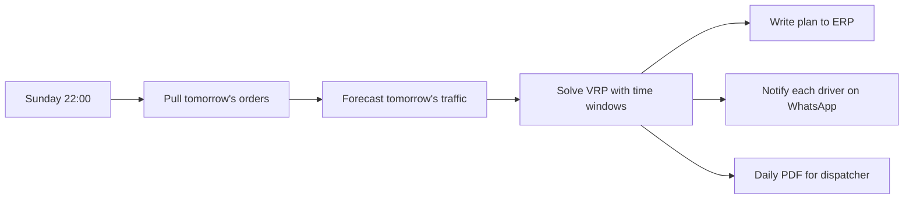

This guide shows you how to build a realistic optimization workflow: pull tomorrow's delivery orders, solve a vehicle routing problem, push the plan to your ERP, and notify each driver of their route on WhatsApp.

---

## What you will build



A weekly pipeline that runs Sunday night and gives every driver their next morning's plan before they start.

---

## Step 1 — Pull tomorrow's orders

```yaml
- id: orders
  type: data_query
  query: |
    SELECT
      order_id,
      customer_name,
      address_lat, address_lng,
      time_window_start, time_window_end,
      service_duration_minutes,
      weight_kg
    FROM orders
    WHERE delivery_date = CURRENT_DATE + INTERVAL '1 day'
      AND status = 'ready_to_dispatch'
```

You can also pull from your ERP via a connector if the data lives outside the warehouse.

---

## Step 2 — Solve the VRP

```yaml
- id: route
  type: optimize
  problem_type: vehicle_routing
  inputs:
    depot:
      lat: 41.0082
      lng: 28.9784
    nodes: ${orders.rows}
    vehicles:
      - id: van-1
        capacity_kg: 800
        start: depot
        end: depot
      - id: van-2
        capacity_kg: 800
        start: depot
        end: depot
      - id: van-3
        capacity_kg: 1200
        start: depot
        end: depot
    cost_function: distance + time_penalty
    time_windows: true
    drop_penalty: 1000        # allow dropping stops; penalty is the cost
  solver_options:
    strategy: guided_local_search
    time_limit_seconds: 30
```

The solver returns:

- An ordered stop list per vehicle (`route.routes[0].stops`)
- Total distance and time
- A drop list (stops that did not fit)
- A Gantt-style timing for stops with time windows
- A chart visualization (`route.chart_id`) you can embed or attach to messages

---

## Step 3 — Push the plan to your ERP

```yaml
- id: write_back
  type: rest_api
  tool_ref: erp_set_route
  body:
    delivery_date: ${orders.rows[0].delivery_date}
    routes: ${route.routes}
```

Mark this step with `compensate: erp_clear_route` so if anything downstream fails, the platform automatically rolls back the write.

---

## Step 4 — Notify each driver

Use `fan_out` to send a personalized WhatsApp message to each driver:

```yaml
- id: notify_drivers
  type: fan_out
  targets: ${route.routes}
  sub_pipeline:
    steps:
      - id: render
        type: llm_transform
        prompt: |
          Compose a friendly WhatsApp message for the driver with their stops
          in order. Include each customer name, address, and time window.
        input_keys: ["target"]
        output_key: message

      - id: send
        type: publish
        channel: whatsapp
        target: ${target.driver_phone}
        text: ${message}
        attachments:
          - chart_id: ${route.chart_id}
            format: png
            filter: { vehicle_id: ${target.vehicle_id} }
```

Three drivers → three WhatsApp messages, each with their route map and a friendly text in their own language.

---

## Step 5 — Generate the dispatcher's PDF

```yaml
- id: dispatcher_pdf
  type: render_dashboard
  dashboard_id: daily-dispatch
  format: pdf
  filters:
    delivery_date: ${orders.rows[0].delivery_date}

- id: email_dispatcher
  type: publish
  channel: mail
  to: ["dispatch@example.com"]
  subject: "Routes for ${orders.rows[0].delivery_date}"
  attachments: ${dispatcher_pdf.artifact_path}
```

The dispatcher gets a multi-page PDF with the per-vehicle plans, a summary KPI table, and the route map.

---

## Schedule it

```yaml
trigger:
  type: cron
  expression: "0 22 * * SUN"
  timezone: Europe/Istanbul
```

Every Sunday at 22:00, the entire pipeline runs. By Monday morning everyone has their plan.

---

## Tuning the solver

| Setting | Effect |
|---|---|
| `time_limit_seconds` | Cap solver runtime (capped to 120 s by the platform) |
| `strategy` | `cheapest_arc`, `guided_local_search`, `tabu`, etc. |
| `drop_penalty` | Higher = drop fewer stops; lower = drop more stops |
| `objective_tolerance` | Stop early once gap is below threshold |
| `warm_start` | Seed with last week's solution -- typically 2-5x speedup |

For 50-100 stops, expect 5-30 seconds. For 500+, you may need to relax `time_limit_seconds` or accept a near-optimal solution.

---

## Variations

- **Live re-optimization**: replace cron trigger with an event trigger on `stream:orders:new` to re-plan in flight
- **Multi-day rolling plans**: extend horizon to 7 days, with stops floating to the best day in the window
- **Multi-depot**: declare multiple depots; solver picks the best one per vehicle
- **Pickup and delivery pairs**: useful for paratransit, courier services, manufacturing logistics
