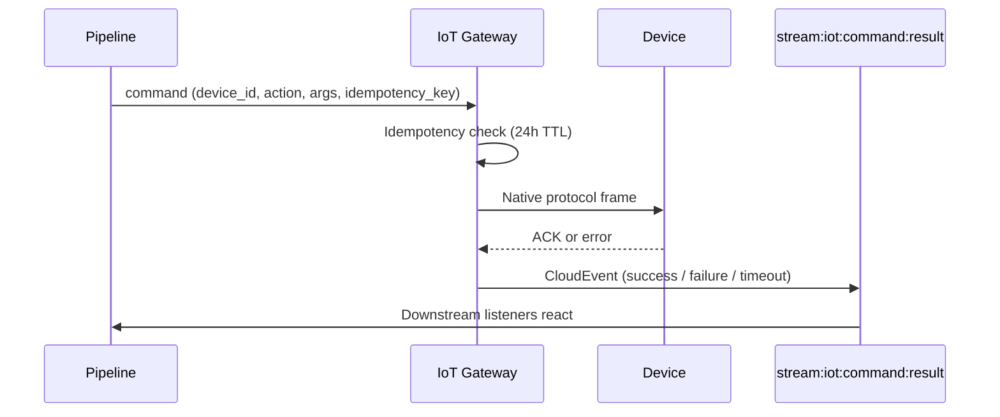

DEHA ONE is not just an inbound platform. For bidirectional protocols you can also send commands to actuators, write to PLC registers, or push notifications back to a device fleet.

<Warning>
  Commands are real actions on real hardware. Treat them like database writes -- always include an idempotency key and consider human approval (HITL) gates for high-stakes actions.
</Warning>

---

## Supported command protocols

| Protocol | Command capabilities |
|---|---|
| **MQTT / MQTTS** | Publish a payload to a topic (broker fan-out) |
| **OPC-UA** | Write to a writable node, or call a method with typed arguments |
| **Modbus TCP / RTU** | Write to a coil (1-bit), holding register (16-bit), or block of registers |
| **HTTP polling** | Not supported (inbound only) |
| **Inbound webhook** | Not supported (inbound only) |

---

## How a command flows



Every command is wrapped in a CloudEvent with `user_id`, `idempotency_key`, and a `correlation_id` that links it to the result event.

---

## Built-in guarantees

| Guarantee | How it works |
|---|---|
| **Idempotency** | Same `idempotency_key` within 24 hours = no double-fire. The Gateway returns the first result. |
| **Timeouts** | Default 30 seconds. Configurable per command. After timeout, a `command.timeout` event is emitted. |
| **Retries** | Up to 3 retries with exponential backoff for transient protocol errors. Application-level errors (e.g. invalid Modbus address) are not retried. |
| **Authorization** | Only commands declared in the device's `allowed_commands` list are accepted. Anything else returns `command.rejected`. |
| **Audit** | Every command attempt is logged with caller identity, args (with secrets redacted), result, and timing. |

---

## Triggering commands

You can fire a command from:

- **A pipeline step** -- the `iot_command` step type wraps the call with all the guarantees above
- **An agent tool** -- bind the command as a tool the agent can call (good for human-language control, e.g. "turn off pump 3")
- **The API** -- direct programmatic invocation for your own apps
- **A scheduled job** -- send recurring commands (e.g. nightly calibration)
- **A webhook** -- map an external signal to a command

---

## Example: stop the pump if vibration spikes

```yaml
pipeline: stop-pump-on-spike
trigger:
  type: event
  stream: stream:iot:telemetry
  filter: data.device_id == 'pump-7' && data.vibration > 8.0

steps:
  - type: analyze
    task: anomaly
    input: ${trigger.window}
    if_anomaly: continue
    else: stop

  - type: human_review        # optional safety gate
    timeout_seconds: 60
    auto_action_on_timeout: reject
    message: "Vibration spike on pump-7. Approve emergency stop?"

  - type: iot_command
    device_id: pump-7
    action: write_register
    args: { address: 40001, value: 0 }
    idempotency_key: "stop-pump-7-${trigger.window_id}"
```

This pipeline reacts to a vibration spike, checks for an anomaly, asks an operator for approval (with auto-reject after 60 seconds), and then stops the pump -- with full audit and a single-fire guarantee.

---

## Observability

For every command you get:

- A `command.dispatched` event when accepted
- A `command.result` event when the device responds
- A `command.timeout` or `command.failed` event on errors
- Latency, success rate, and idempotency hit rate in the metrics dashboard
- Full payload (with secret redaction) in the structured logs
