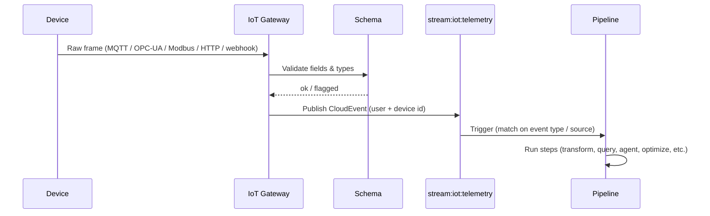

The IoT Gateway is the bridge between the physical world and your DEHA ONE agents and pipelines. It speaks the protocols industrial devices already speak -- **MQTT, OPC-UA, Modbus, HTTP polling, and inbound webhooks** -- and turns their telemetry into events your platform can react to.

<Info>
  Every connection is per-user isolated. A device registered to one user cannot send data into another, and rate limits, schemas, and offline detection are scoped accordingly.
</Info>

---

## What you can do

<CardGroup cols={2}>
  <Card title="Stream telemetry" icon="signal-stream">
    Sensors, PLCs, gateways, and any HTTP-capable device can push readings to DEHA ONE at any rate. The platform normalizes every reading into a single internal event format.
  </Card>
  <Card title="Send commands" icon="paper-plane">
    Trigger actuators, write Modbus coils, call OPC-UA methods, or push MQTT messages back to devices -- with idempotency keys and result timeouts.
  </Card>
  <Card title="Validate against schemas" icon="circle-check">
    Each device has a typed schema (booleans, integers, floats, strings, timestamps, objects). Bad readings are flagged before they reach your pipelines.
  </Card>
  <Card title="Detect offline devices" icon="plug-circle-xmark">
    Per-device heartbeats and a sweep job mark devices offline after a configurable silence threshold. Your pipelines can react to the offline event.
  </Card>
  <Card title="Hot-reload device configs" icon="rotate">
    Add, remove, or reconfigure devices in YAML -- live, no restart. Existing connections rebind to the new config automatically.
  </Card>
  <Card title="Trigger pipelines from devices" icon="bolt">
    Every telemetry event is a CloudEvent. Match it in your pipeline's trigger config and run any of the 27 step types in response.
  </Card>
</CardGroup>

---

## Supported protocols

DEHA ONE talks to devices in their native wire protocols. Pick the one your hardware already uses.

| Protocol | Direction | Typical use |
|---|---|---|
| **MQTT / MQTTS** | Bidirectional | Pub/sub for sensors, gateways, mobile, and broker-fronted fleets |
| **OPC-UA** | Bidirectional | Industrial automation, PLCs, SCADA systems |
| **Modbus TCP / RTU** | Bidirectional | Legacy industrial devices, energy meters, motor controllers |
| **HTTP polling** | Inbound | Devices that expose a status endpoint but cannot push |
| **Inbound webhooks** | Inbound | Devices or gateways that can POST JSON, raw bytes, or CSV |

Each connection runs as its own asyncio task with exponential-backoff reconnect, per-device rate limiting, and an isolated DLQ for messages that fail validation. See [Protocols](/iot/protocols) for setup details.

---

## How a frame becomes a pipeline event

Once the telemetry is on the stream, **anything in the platform can react to it** -- alerts via Slack, anomaly detection, forecasting, dashboard updates, agent escalation, or commands back to the device.

---

## Devices and schemas

Every device belongs to a user and has:

- A unique **device ID** (stable across reconnects)
- A **schema** that defines which fields are expected, their types, and whether they are required
- A **rate limit** (max events per second)
- A **heartbeat interval** (when no traffic arrives, the device is marked offline)
- A list of allowed **commands** (for bidirectional protocols)

See [Devices & Schemas](/iot/devices-and-schemas) for the YAML reference and validation rules.

---

## Sending commands back

For MQTT, OPC-UA, and Modbus connections, you can send commands from your pipelines or directly from the API:

- **MQTT**: publish a payload to a topic
- **OPC-UA**: write to a node, call a method
- **Modbus**: write to a coil or register
- **HTTP**: not supported (HTTP polling is read-only)
- **Webhook**: not supported (webhooks are inbound only)

Every command carries an idempotency key (so retries do not double-fire actuators), a result timeout, and ends up on `stream:iot:command:result` for downstream listeners. See [Commands & Control](/iot/commands-and-control).

---

## Common patterns

<AccordionGroup>
  <Accordion title="Predictive maintenance from CNC machines">
    Modbus TCP pulls vibration and temperature from each machine. An anomaly-detection pipeline flags deviations. An agent opens a maintenance ticket and posts to a Slack channel.
  </Accordion>
  <Accordion title="Energy demand forecasting">
    OPC-UA polls meter readings every minute. A forecasting pipeline (StatsForecast / Prophet) generates next-day demand. The result feeds an optimization pipeline that schedules generation assets.
  </Accordion>
  <Accordion title="Cold-chain monitoring">
    Webhook endpoints accept temperature events from a fleet of trucks. A pipeline alerts when readings fall outside the cold-chain band, and an agent notifies the dispatcher with the truck's last GPS position.
  </Accordion>
  <Accordion title="Smart-building HVAC">
    MQTT subscribes to building sensors. A pipeline triggers OPC-UA writes back to the BMS to adjust setpoints based on occupancy and outdoor weather pulled from the data engine.
  </Accordion>
</AccordionGroup>

---

## Next steps

<CardGroup cols={2}>
  <Card title="Protocols" icon="ethernet" href="/iot/protocols">
    MQTT, OPC-UA, Modbus, HTTP polling, and webhooks in detail.
  </Card>
  <Card title="Devices & Schemas" icon="microchip" href="/iot/devices-and-schemas">
    Declare devices, define schemas, set rate limits and heartbeats.
  </Card>
  <Card title="Commands & Control" icon="paper-plane" href="/iot/commands-and-control">
    Send commands back to devices with idempotency and result tracking.
  </Card>
  <Card title="Connect an IoT device (guide)" icon="play" href="/guides/connect-iot-device">
    End-to-end walkthrough -- from device declaration to live pipeline.
  </Card>
</CardGroup>
