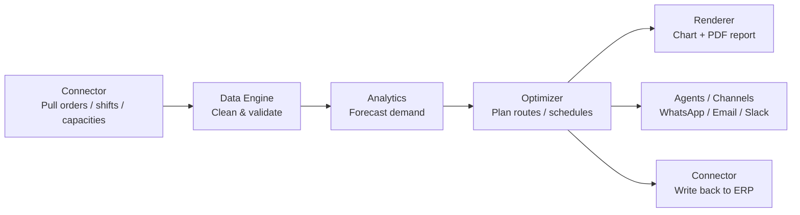

Some problems are too combinatorial for an LLM and too structured for a database query. **Optimization** is where DEHA ONE plugs in Google OR-Tools to solve them properly -- and then summarizes the solution in plain English with a chart.

<Info>
  Every optimization run is a regular pipeline step. You can chain it: pull demand from your warehouse → forecast next week → optimize routes → push the plan to your dispatcher → notify drivers on WhatsApp.
</Info>

---

## What it solves

<CardGroup cols={2}>
  <Card title="Routing" icon="route">
    Vehicle routing with capacity, time windows, multiple depots, and pickup/delivery pairs.
  </Card>
  <Card title="Scheduling" icon="calendar-days">
    Job shop, employee shift, and resource-constrained scheduling.
  </Card>
  <Card title="Assignment" icon="people-arrows">
    Match workers to tasks, drivers to vehicles, applicants to interviews -- minimizing total cost.
  </Card>
  <Card title="Packing" icon="boxes-stacked">
    Bin packing, knapsack, cutting stock -- fit items into containers efficiently.
  </Card>
  <Card title="Network flow" icon="diagram-project">
    Minimum-cost flow on graphs: supply chains, traffic, telecoms.
  </Card>
  <Card title="LP & MIP" icon="square-root-variable">
    Generic linear and mixed-integer programming for any custom objective.
  </Card>
</CardGroup>

---

## When to reach for optimization

| You want to ... | Use this problem type |
|---|---|
| Minimize total drive time across a fleet that has capacity and time-window constraints | Vehicle Routing |
| Decide which employees work which shifts, respecting skills, hours, and preferences | Scheduling (CP-SAT) |
| Pair drivers, cases, or applicants 1:1 by lowest aggregate cost | Assignment (Hungarian) |
| Stuff items into trucks, bins, or pallets without overflow | Bin Packing |
| Maximize profit subject to budget and resource limits | LP or MIP |
| Route cargo or telecom traffic through a graph with capacities | Min-Cost Network Flow |

If you only need a single best option (e.g. "which warehouse has the most stock"), you do not need optimization -- a SQL query is enough. Use optimization when the answer depends on **picking many things together** under constraints.

---

## The output

Every solved problem returns:

1. **The solution** as structured JSON (routes, assignments, schedules, etc.)
2. **A visualization** appropriate to the problem type:
   - Routes drawn on a map (or as a chart for non-geographic VRPs)
   - Gantt charts for scheduling
   - Bar charts for LP/MIP objectives
   - Bin diagrams for packing
   - Flow diagrams for network flow
3. **A plain-language summary** generated by an LLM ("Saved 18% drive time across 12 routes; one stop reassigned to vehicle 4 to fit the window.")
4. **Solver metadata** -- objective value, gap, runtime, whether the solution is optimal or feasible

You can return any of these to your user, embed them in a dashboard, or feed them to the next step in a pipeline.

---

## How it fits with the rest of the platform

Optimization is rarely the first step or the last step -- it sits in the middle of a workflow.

DEHA can wire this entire pipeline up for you from a sentence like *"every Sunday night, plan next week's delivery routes for the warehouse and send each driver their stops by WhatsApp"*.

---

## Tuning the solver

| Setting | What it does |
|---|---|
| **Time limit** | Maximum time the solver may run (capped at 120 s by the platform). Smaller limit = faster reply, possibly suboptimal. |
| **Objective tolerance** | Stop once the optimality gap is below a threshold. |
| **Strategy** | For VRPs: `guided_local_search`, `tabu`, `cheapest_arc`, etc. The platform sets sensible defaults. |
| **Warm start** | For MIPs: provide a previous solution to speed up convergence. |

You can also pass solver hints (initial routes, fixed assignments) when you already know part of the answer.

---

## Next steps

<CardGroup cols={2}>
  <Card title="Problem Types" icon="shapes" href="/optimization/problem-types">
    Detailed reference for all seven problem types, what they need as input, and what they return.
  </Card>
  <Card title="Optimize routes and schedules (guide)" icon="play" href="/guides/optimize-routes-and-schedules">
    End-to-end walkthrough: data in → solution out → notification on WhatsApp.
  </Card>
</CardGroup>
