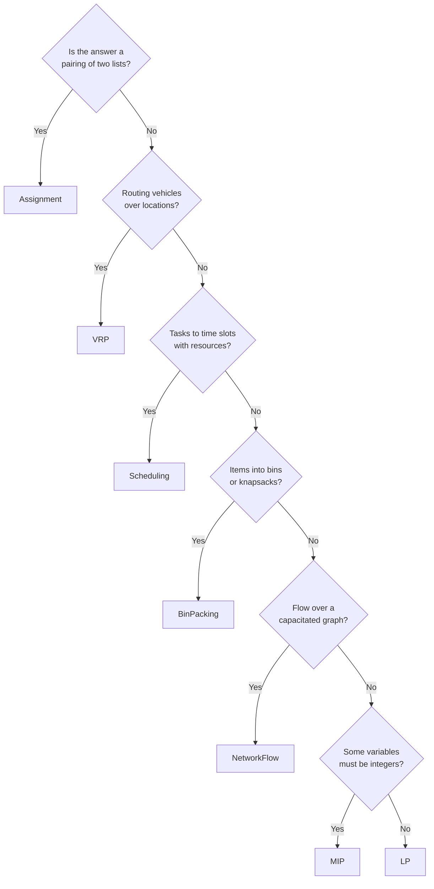

DEHA ONE supports seven problem types out of the box, each backed by an OR-Tools solver tuned for that family. You pick the type that fits your problem; the solver, visualization, and summary are wired up automatically.

---

## 1. Linear Programming (LP)

**Use it when** every variable is continuous and the objective and constraints are all linear.

| Aspect | Detail |
|---|---|
| **Solver** | GLOP (Simplex / Barrier) |
| **Variables** | Continuous |
| **Speed** | Very fast even for tens of thousands of variables |
| **Typical problems** | Blending, production planning, transportation, budget allocation |

**Input you provide:** objective coefficients, constraint coefficients and bounds, variable bounds.
**You get back:** optimal values for every variable, objective value, shadow prices, sensitivity report.

---

## 2. Mixed-Integer Programming (MIP)

**Use it when** some variables must be integers (counts, on/off decisions, indices).

| Aspect | Detail |
|---|---|
| **Solver** | SCIP / CBC (branch-and-bound) |
| **Variables** | Continuous + integer/binary |
| **Speed** | Hard problems may take time; the platform enforces a 120-second cap |
| **Typical problems** | Facility location, capital budgeting, crew rostering, inventory with batch sizes |

**Input:** as for LP, plus which variables are integer/binary.
**You get back:** best feasible solution found, MIP gap, optimality flag.

---

## 3. Vehicle Routing (VRP)

**Use it when** you need to route a fleet through customers minimizing time/distance under capacity and time-window constraints.

| Aspect | Detail |
|---|---|
| **Solver** | Constraint solver with guided local search (CP) |
| **Capabilities** | Capacity, time windows, multi-depot, pickup-and-delivery, dropping nodes with penalties |
| **Visualization** | Map view (if coordinates) or route diagram |
| **Typical problems** | Last-mile delivery, field service, waste collection, paratransit |

**Input:** depot(s), nodes (customer stops with demand, service time, optional time window), fleet (vehicles with capacity, optional start/end depot), cost matrix or coordinates.
**You get back:** an ordered list of stops per vehicle, total distance/time, drop list (if any), Gantt-style timing for time-windowed runs.

---

## 4. Scheduling

**Use it when** you need to assign tasks to time slots and resources under hard rules.

| Aspect | Detail |
|---|---|
| **Solver** | CP-SAT (constraint programming with SAT learning) |
| **Capabilities** | Precedence, no-overlap, cumulative resources, skill matching, shift caps |
| **Visualization** | Gantt chart |
| **Typical problems** | Job shop, employee shifts, classroom timetabling, surgery scheduling |

**Input:** tasks with durations, resource pool, dependencies, resource constraints, optional preferences/costs.
**You get back:** start/end time and assigned resource for every task, total makespan or cost.

---

## 5. Assignment

**Use it when** you need a 1:1 (or near-1:1) pairing that minimizes total cost.

| Aspect | Detail |
|---|---|
| **Solver** | Hungarian algorithm (`O(n³)`) |
| **Speed** | Instant for hundreds of items |
| **Typical problems** | Worker-to-task, driver-to-vehicle, applicant-to-interview, mentor-to-mentee |

**Input:** two lists (left, right) and a cost matrix between them.
**You get back:** the optimal pairing and total cost.

---

## 6. Bin Packing

**Use it when** you need to fit items into a fixed number of bins or use as few bins as possible.

| Aspect | Detail |
|---|---|
| **Solver** | CP-SAT with symmetry breaking |
| **Capabilities** | Multiple bin sizes, item incompatibility constraints, weight + volume |
| **Visualization** | Stacked bin diagram |
| **Typical problems** | Truck loading, server consolidation, cutting stock, container packing |

**Input:** items with size/weight, bins with capacity, optional incompatibility rules.
**You get back:** item-to-bin assignment, bins used, leftover capacity per bin.

---

## 7. Network Flow

**Use it when** you have a graph with capacities and costs and need to route flow optimally.

| Aspect | Detail |
|---|---|
| **Solver** | Successive shortest path (min-cost flow) |
| **Speed** | Linear in problem size for typical graphs |
| **Typical problems** | Supply chain, telecom routing, energy grid, transportation networks |

**Input:** node supplies/demands, edges with capacity and unit cost.
**You get back:** flow on every edge, total cost, infeasibility report if the problem is over-constrained.

---

## Choosing the right type

---

## Tips

- **Start small.** Solve a 10-stop, 2-vehicle VRP before throwing 500 stops at it.
- **Use time limits.** A near-optimal solution in 5 seconds usually beats an optimal one in 5 minutes.
- **Warm start when possible.** If you optimize daily, seed today's run with yesterday's solution.
- **Soft constraints beat infeasibility.** Adding a penalty for "drop this customer" lets the solver return a useful plan even when demand exceeds capacity.
- **Validate the input.** Bad data is the most common cause of bad solutions -- use the [Data Engine](/data/data-quality) to clean and validate first.
