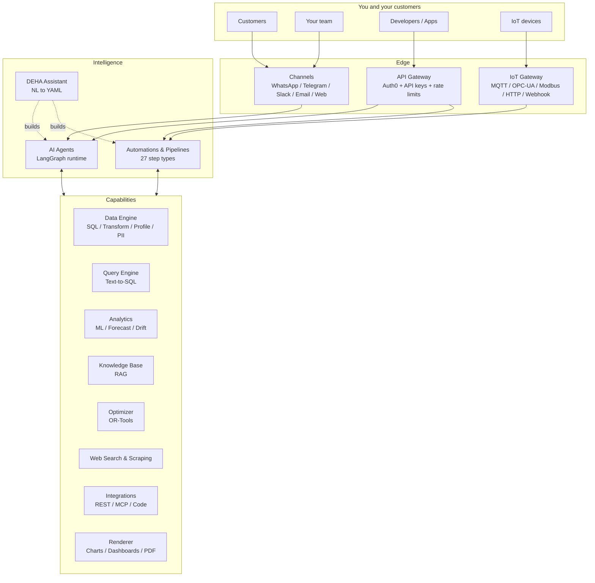

DEHA ONE is a single platform with many capabilities. This page is the map -- read it once to understand the whole platform, then dive into the section you need.

---

## The big picture

Every external entry point (channel, device, API call) flows into the **Agents** or **Pipelines** layer. From there, agents and pipelines compose any of the platform's capabilities to do their job.

---

## Capability map -- when to use what

| If you want to ... | Use ... |
|---|---|
| Talk to customers on WhatsApp / Telegram / Slack / Email / Web | [Channels](/channels/overview) + [Agents](/agents/overview) |
| Build a multi-step workflow with retries, branching, and rollback | [Automations & Pipelines](/automations/overview) |
| Ask questions about your database in plain English | [Query Engine -- text-to-SQL](/data/querying-data) |
| Forecast next quarter's demand or detect anomalies | [Analytics](/data/analytics) |
| Track when your model's predictions start drifting | [Drift detection](/guides/forecast-and-drift) |
| Clean, validate, dedup, scrub PII, or generate synthetic data | [Data Engine](/data/data-quality) + [Privacy & PII](/data/privacy-and-pii) |
| Snapshot data with rollback (time-travel) | [Data versioning & BYOD](/data/versioning-and-byod) |
| Answer questions from PDFs, DOCX, spreadsheets, or webpages | [Knowledge Base](/knowledge-base/overview) |
| Ingest sensor data over MQTT, OPC-UA, or Modbus | [IoT Gateway](/iot/overview) |
| Solve routing, scheduling, assignment, or packing problems | [Optimization](/optimization/overview) |
| Search the web (Google, Tavily, Brave, YouTube, complaints sites) | [Web Search](/web-intel/search) |
| Scrape webpages into clean markdown or structured JSON | [Web Scraping](/web-intel/scraping) |
| Generate charts from plain English or export PDF dashboards | [Visualizations & Reports](/viz/overview) |
| Call your REST APIs, run Python, or expose tools via MCP | [Integrations](/integrations/overview) |
| Pause for human approval mid-workflow | [Human Review](/automations/human-review) |
| Run scheduled jobs (cron, intervals, events, data changes) | [Scheduling](/automations/scheduling) |
| Build all of the above by chatting in plain English | [DEHA Assistant](/deha/overview) |

---

## Bring Your Own Data and Keys

DEHA ONE processes data but does not own it. Your business data lives in your warehouse.

**BYOD (Bring Your Own Data)**
- Connectors: PostgreSQL, MySQL, MSSQL, Oracle, SQLite, MongoDB, REST, SFTP, CSV / Excel / JSON / Parquet, Webhooks
- External vector store: route to your own Qdrant
- External archive: store events in your own MongoDB
- Snapshot sink: time-travel versioning with rollback

**BYOK (Bring Your Own Keys)**
- LLM providers: OpenAI, Anthropic, Google (including Vertex AI with your GCP service account), DeepSeek, self-hosted
- Embedding providers: OpenAI, Google, HuggingFace, custom
- Tool credentials: OAuth2, API keys, signed webhooks -- all vaulted and never logged

---

## Multi-channel, multi-user, multi-model

| Dimension | How it works |
|---|---|
| **Channels** | One agent serves every channel. Same context, same knowledge, same tools, regardless of where the user messaged from. |
| **Users** | Hard isolation across every layer: data, vectors, vault, lineage, billing, logs. Cross-user access is structurally impossible. |
| **Models** | Pick a model per agent or per call. Use semantic aliases (`fast`, `smart`, `cheap`, `reasoning`) and the platform routes -- with cross-provider fallback chains. |
| **Versions** | Run multiple versions of an agent simultaneously with weighted traffic. Sticky routing keeps a returning user on the same variant. |
| **Hot reload** | Every config change deploys atomically with zero downtime. Pipeline endpoints, schedules, channels, IoT devices all reconfigure live. |

---

## Built-in trust

| Concern | Mitigation |
|---|---|
| Unauthorized access | Auth0 JWT (RS256) + per-user API keys + per-entity keys + IP whitelist (user + per-agent) |
| Credential leaks | SOPS + age encrypted vault, `$vault:` references, never logged, dual-write to Mongo for durability |
| Runaway costs | Per-user credit limits, alert thresholds (80% default), overage actions (alert / throttle / block), sliding-window rate limits |
| Bad agent output | AI judge with 6-dimensional scoring, optional human review gates, full audit log |
| Data leakage between users | User ID on every record, lineage namespace enforcement, distributed locks, dedicated DuckDB files |
| Lost messages | Consumer groups, idempotency keys (24h TTL), dead-letter queues, pipeline checkpoints with saga compensation |
| LLM hallucination | Knowledge base with citations, cross-encoder reranking, judge agents, deterministic JSON schema outputs |

---

## What's in the box

| Layer | What it does | Read more |
|---|---|---|
| **DEHA Assistant** | Builds and heals platform configurations from natural language | [DEHA →](/deha/overview) |
| **AI Agents** | LangGraph-based runtime with 19+ node types, interrupts, HITL, multi-agent delegation | [Agents →](/agents/overview) |
| **Automations & Pipelines** | 27 step types, scheduling, human review, checkpoint / saga | [Automations →](/automations/overview) |
| **Channels** | WhatsApp, Telegram, Email, Slack, Web -- unified inbound/outbound | [Channels →](/channels/overview) |
| **Data & Analytics** | Connectors, DuckDB OLAP, text-to-SQL, ML, drift, PII, entity resolution | [Data →](/data/overview) |
| **Knowledge Base (RAG)** | Multi-format parsing (Docling), embeddings, reranking, BYOD Qdrant | [Knowledge →](/knowledge-base/overview) |
| **IoT & Devices** | MQTT / OPC-UA / Modbus / HTTP / Webhook with per-device schemas | [IoT →](/iot/overview) |
| **Optimization** | OR-Tools: routing, scheduling, assignment, packing, network flow | [Optimization →](/optimization/overview) |
| **Web Intelligence** | 13-provider search + Crawl4AI scraping | [Web Intel →](/web-intel/overview) |
| **Visualizations & Reports** | Vega-Lite charts, embeds, PDF dashboards, fleet reports | [Viz →](/viz/overview) |
| **Integrations** | REST tools, sandboxed Python, MCP servers, per-agent MCP endpoints | [Integrations →](/integrations/overview) |
| **Billing & Usage** | Credits, quotas, forecasts, CSV ledger, cost attribution | [Billing →](/billing/overview) |
| **Security & Access** | Auth0, RBAC, API keys, vault, IP whitelist, audit | [Security →](/security/overview) |

---

## How to learn the platform

1. **Read the [Quickstart](/quickstart)** -- create your first agent and connect a channel.
2. **Skim each section's Overview** -- the cards above link to one-page intros.
3. **Build something small with DEHA** -- describe a use case in plain English and watch it deploy.
4. **Walk through a Guide** -- step-by-step tutorials for common scenarios: [Guides →](/guides/first-agent).
5. **Reference the API** when you start integrating: [API Reference →](/api-reference/overview).
