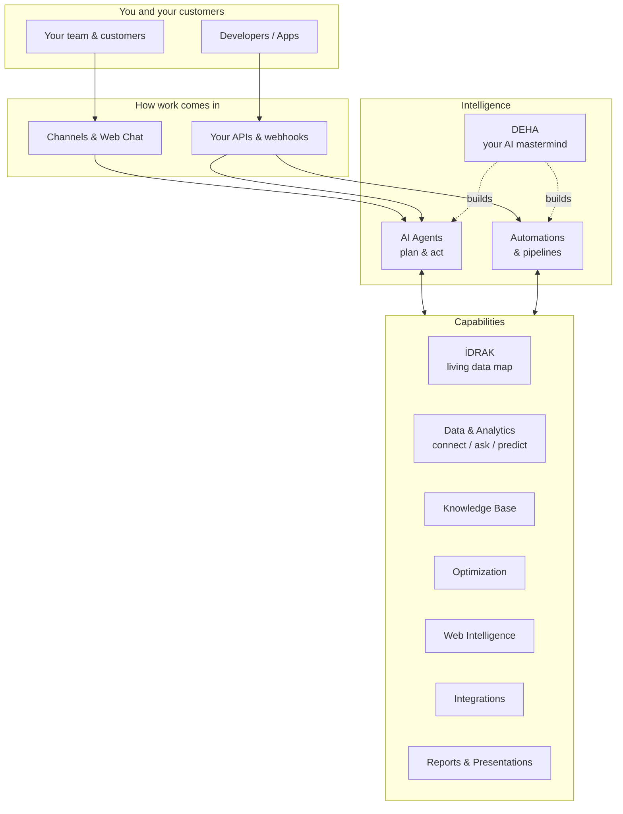

DEHA ONE is a single platform with many capabilities. This page is the map, read it once to understand the whole platform, then dive into the section you need.

<Tip>
  Prefer the story behind the platform? Read [The DEHA ONE Model](/concepts), one continuous flow from your intent to a finished outcome.
</Tip>

---

## The big picture

```mermaid
flowchart TB
    subgraph You["You and your customers"]
        User[Your team & customers]
        Devs[Developers / Apps]
    end

    subgraph Entry["How work comes in"]
        Channels[Channels & Web Chat]
        API[Your APIs & webhooks]
    end

    subgraph Brain["Intelligence"]
        DEHA[DEHA<br/>your AI mastermind]
        Agents[AI Agents<br/>plan & act]
        Pipelines[Automations<br/>& pipelines]
    end

    subgraph Capability["Capabilities"]
        Idrak[İDRAK<br/>living data map]
        Data[Data & Analytics<br/>connect / ask / predict]
        Knowledge[Knowledge Base]
        Optimize[Optimization]
        Web[Web Intelligence]
        Tools[Integrations]
        Sunu[Reports & Presentations]
    end

    User --> Channels
    Devs --> API
    Channels --> Agents
    API --> Agents
    API --> Pipelines
    DEHA -.builds.-> Agents
    DEHA -.builds.-> Pipelines
    Agents <--> Capability
    Pipelines <--> Capability
```

Every way work comes in, a customer message, a scheduled job, an API call, flows into the **Agents** or **Automations** layer. From there, your agents and automations compose any of the platform's capabilities to get the job done.

---

## Capability map, when to use what

| If you want to ... | Use ... |
|---|---|
| Build all of the below by describing it in plain language | [DEHA Mastermind](/deha/overview) |
| See all your data in one map and ask questions across it | [İDRAK, Living Data Map](/idrak/overview) |
| Build a multi-step workflow with retries, branching, and rollback | [Automations & Pipelines](/automations/overview) |
| Have agents plan, use tools, and act on your behalf | [AI Agents](/agents/overview) |
| Ask questions about your database in plain language | [Ask your data](/data/querying-data) |
| Forecast demand or detect anomalies | [Analytics](/data/analytics) |
| Clean, validate, deduplicate, or protect personal data | [Data Quality](/data/data-quality) + [Privacy & PII](/data/privacy-and-pii) |
| Snapshot data with rollback (time-travel) | [Data versioning & BYOD](/data/versioning-and-byod) |
| Answer questions from documents, spreadsheets, or webpages | [Knowledge Base](/knowledge-base/overview) |
| Solve routing, scheduling, assignment, or packing problems | [Optimization](/optimization/overview) |
| Search the web and turn any link into clean content | [Web Intelligence](/web-intel/overview) |
| Generate charts, dashboards, and polished PDF reports | [Reports & Presentations](/viz/overview) |
| Call your REST APIs, run Python, or expose tools via MCP | [Integrations](/integrations/overview) |
| Pause for human approval mid-workflow | [Human Review](/automations/human-review) |
| Run scheduled or event-driven jobs | [Scheduling](/automations/scheduling) |
| Reach customers on WhatsApp, Telegram, Slack, Email, or Web | [Channels](/channels/overview) |

---

## Bring Your Own Data and Keys

DEHA ONE processes data but does not own it. Your business data lives on your own infrastructure.

**BYOD (Bring Your Own Data)**
- Connect databases, REST APIs, cloud storage, and files (CSV, Excel, JSON, Parquet) and webhooks
- Results sink back to your own databases and storage, the platform keeps only the operational layer
- Route to your own vector store and your own archive
- Snapshot versioning with time-travel and rollback

**BYOK (Bring Your Own Keys)**
- Bring your own AI provider credentials, including self-hosted models
- Embeddings, completions, and tools run on your accounts
- Tool credentials (OAuth2, API keys, signed webhooks) are vaulted and never logged

---

## Multi-user, multi-model, always live

| Dimension | How it works |
|---|---|
| **Workspaces** | Hard isolation across every layer: data, knowledge, credentials, lineage, billing, and logs. Cross-workspace access is structurally impossible. |
| **Models** | Pick a model per agent or per call. Use simple aliases (`fast`, `smart`, `cheap`, `reasoning`) and the platform routes, with cross-provider fallback. |
| **Versions** | Run multiple versions of an agent at once with weighted traffic. Returning users stay on the same variant. |
| **Always live** | Every change deploys with zero downtime. Agents, automations, schedules, and channels reconfigure live. |
| **Channels** | One agent serves every channel with the same context, knowledge, and tools, wherever the customer messaged from. |

---

## Built-in trust

| Concern | How DEHA ONE handles it |
|---|---|
| Unauthorized access | Single sign-on, per-user and per-entity API keys, IP allow-lists |
| Credential leaks | Encrypted vault, secure vault references, never logged |
| Runaway costs | Per-user credit limits, alert thresholds, overage actions (alert / throttle / block), rate limits |
| Bad agent output | Automatic quality scoring, optional human review gates, full audit log |
| Data leakage between users | Full per-workspace isolation enforced at every layer |
| Lost messages | Reliable delivery with automatic retries, failure recovery, and rollback |
| AI hallucination | Cited answers from your knowledge and data map, semantic reranking, and review gates |

---

## What's in the box

| Capability | What it does | Read more |
|---|---|---|
| **DEHA Mastermind** | Builds and heals your setup from plain language | [DEHA →](/deha/overview) |
| **İDRAK, Living Data Map** | One living map of all your data and what it means | [İDRAK →](/idrak/overview) |
| **AI Agents** | Agents that plan, use tools, act, and delegate | [Agents →](/agents/overview) |
| **Automations & Pipelines** | A rich library of building blocks, scheduling, human review, automatic recovery | [Automations →](/automations/overview) |
| **Data & Analytics** | Connectors, ask-your-data, ML, forecasting, drift, privacy & PII | [Data →](/data/overview) |
| **Knowledge Base** | Multi-format documents into instant, cited answers | [Knowledge →](/knowledge-base/overview) |
| **Reports & Presentations** | Charts, dashboards, and polished PDF / Word reports | [Reports →](/viz/overview) |
| **Optimization** | Routing, scheduling, assignment, packing, and more | [Optimization →](/optimization/overview) |
| **Web Intelligence** | Multi-provider search + clean content extraction | [Web Intel →](/web-intel/overview) |
| **Integrations** | REST tools, sandboxed Python, and MCP | [Integrations →](/integrations/overview) |
| **Channels** | WhatsApp, Telegram, Email, Slack, Web, unified | [Channels →](/channels/overview) |
| **Billing & Usage** | Credits, quotas, forecasts, and cost attribution | [Billing →](/billing/overview) |
| **Security & Trust** | SSO, roles, API keys, vault, isolation, audit | [Security →](/security/overview) |

---

## How to learn the platform

1. **Read the [Quickstart](/quickstart)**, build your first agent or automation.
2. **Skim each section's Overview**, the cards above link to one-page intros.
3. **Build something small with DEHA**, describe a use case in plain language and watch it deploy.
4. **Walk through a Guide**, step-by-step tutorials for common scenarios: [Guides →](/guides/first-agent).
5. **Reference the API** when you start integrating: [API Reference →](/api-reference/overview).
