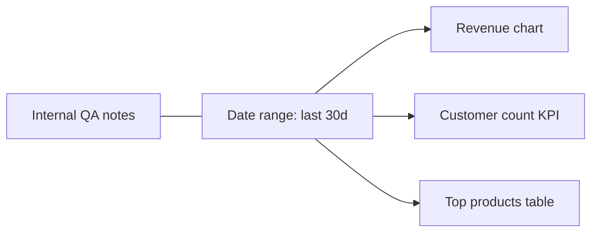

A dashboard is a collection of widgets — charts, tables, big numbers, text blocks — laid out on a grid. Dashboards are versioned, embeddable, and renderable to PDF.

---

## Anatomy of a dashboard

| Element | What it is |
|---|---|
| **Widgets** | Individual cells. Up to 48 per dashboard. Each widget has its own data source, refresh cadence, and (optionally) filter bindings. |
| **Layout** | A grid where every widget has position (row, col) and size (width, height). |
| **Filters** | Global controls — date range, segment selector, user filter — that propagate to bound widgets. |
| **Theme** | Inherits your user brand by default; per-dashboard overrides allowed. |
| **Refresh** | Each widget can refresh on a cadence (live, every minute, hourly, daily) or only on user action. |

---

## Widget types

- **Chart** — anything from the [Charts](/viz/charts) page
- **Table** — paginated tabular view of a query result, with sort and column formatting
- **Big number / KPI** — single value with optional delta vs. prior period
- **Text** — Markdown notes, section headers, callouts
- **Image** — embedded artifact (logo, diagram, screenshot)
- **Map** — geo widget when your data has coordinates

---

## Live data sources

Every widget pulls from one of:

- A **SQL query** via the Query Engine
- A **saved pipeline result** (refreshed on the pipeline's own cadence)
- A **knowledge-base search**
- A **REST API call** via an integration
- A **static dataset** uploaded directly

Per-user access controls always apply — a widget cannot pull data the viewer is not entitled to.

---

## Filters and bindings

Global filters at the top of the dashboard propagate to bound widgets:



You explicitly mark which widgets a filter applies to. Unbound widgets (e.g. a static text note) ignore the filter.

---

## Versioning

Every dashboard definition is a config artifact under the hood:

- Each save creates a new version
- You can diff any two versions side-by-side
- Rollback to any previous version with one click
- Hot reload — viewers see the new version on next refresh without losing scroll position or filter selections

---

## Embedding

Saved dashboards get signed embed URLs that work in any frontend:

```
https://embed.deha.one/d/{dashboard_id}?token=<hs256>
```

You control:

- Whether viewers can change the filters
- Which widgets are visible (e.g. hide internal-only widgets for customer-facing embeds)
- Token expiry and revocation

---

## PDF & PNG snapshots

A dashboard rendered to PDF is a multi-page document with one widget per page (or grouped per layout, your choice). PNG snapshots are flatter — one image per dashboard.

Pair a dashboard with a [scheduled report](/viz/embeds-and-reports) to auto-deliver snapshots via email or Slack.

---

## Performance tips

- **Keep heavy widgets behind a manual refresh.** A widget that scans 1B rows should not be on a one-minute auto-refresh.
- **Use server-side caching.** Set the widget's data refresh to match the natural cadence of the data (e.g., a daily-batch table does not need to refresh every minute).
- **Aggregate before charting.** Avoid pulling raw rows; aggregate in SQL and chart the result.
- **Materialize for hot dashboards.** For a board hit by hundreds of users, pre-compute results in a daily pipeline and chart from the materialized table.
