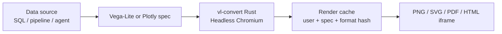

DEHA ONE turns data into visuals at three levels:

1. **Single charts** — bar, line, area, scatter, pie, heatmap, etc.
2. **Dashboards** — multi-widget layouts with filters and live data
3. **Reports** — auto-rendered multi-page PDFs (and PNGs) for fleet, executive, and ops summaries

Every visual is rendered server-side. You get PNG, SVG, PDF, or an embeddable HTML iframe — no frontend code required.

<Info>
  All renders are user-scoped, cached by content hash, and stored in a per-user artifact volume. Sharing is via signed iframe links (HS256) that expire and are revokable.
</Info>

---

## What you can do

<CardGroup cols={2}>
  <Card title="Chart from plain English" icon="sparkles">
    "Plot monthly revenue for the last 12 months as a line chart with a 3-month moving average." DEHA writes the Vega-Lite spec and renders it.
  </Card>
  <Card title="Chart from a spec" icon="code">
    Hand-author Vega-Lite or Plotly specs for full control. The renderer normalizes either input.
  </Card>
  <Card title="Build dashboards" icon="table-cells-large">
    Up to 48 widgets per dashboard, each with its own data source, filter binding, and refresh cadence.
  </Card>
  <Card title="Embed anywhere" icon="square-arrow-up-right">
    HS256-signed iframe URLs embed charts and dashboards in your internal tools — without exposing data or credentials.
  </Card>
  <Card title="Auto-render PDF reports" icon="file-pdf">
    Schedule daily/weekly/monthly PDF snapshots of any dashboard, with optional cover pages and table of contents.
  </Card>
  <Card title="Fleet PDF reports" icon="file-lines">
    Multi-page health reports across hundreds of users, devices, or business units — auto-archived per user.
  </Card>
</CardGroup>

---

## How rendering happens



- **Single charts** render in a Rust process (no browser, very fast).
- **Dashboards and PDF reports** render in a Chromium pool with Jinja2 templates.
- Outputs are cached by a SHA-256 of the spec, format, and dimensions — repeated requests are instant.

---

## Saved charts and dashboards

You can save a chart or dashboard definition under a name. Once saved, you can:

- Embed it in your app with a single iframe URL
- Render it to PDF on a schedule
- Reference it from an agent ("show me the active alerts dashboard")
- Diff its definition across versions (full audit trail via Config Service)

---

## Text-to-chart (LLM-generated)

The fastest way to get a chart is to describe it:

> "Plot a stacked bar chart of WhatsApp messages per agent for the last 30 days, with one bar per day."

The platform:

1. Resolves the data source (your warehouse via the Query Engine)
2. Generates a Vega-Lite spec
3. Validates it (safe SQL, correct field types)
4. Renders it
5. Returns the chart and the spec — so you can save, tweak, or re-use

If anything goes wrong (e.g. the requested column does not exist), the platform tells you why in plain English and offers an alternative.

---

## Embedding

Saved charts and dashboards get signed embed URLs:

```
https://embed.deha.one/c/{chart_id}?token=<hs256>
```

- The token encodes user ID, expiry, and (optionally) a filter set
- Tokens are revokable per chart
- The iframe is fully isolated — no platform cookies, no SDK to install

For internal-only dashboards, you can also serve them through your existing reverse proxy with no public exposure.

---

## Reports

For recurring snapshots, schedule a report:

| Cadence | Common use |
|---|---|
| Daily 8am | Ops health, queue depth, SLA breach summary |
| Weekly Monday | Customer support trends, agent quality scores |
| Monthly 1st | Executive KPI report, billing summary |
| On-demand | Incident review, customer onboarding deck |

Reports are stored in the user archive, retained per your policy, and optionally emailed or posted to a channel.

---

## Next steps

<CardGroup cols={3}>
  <Card title="Charts" icon="chart-line" href="/viz/charts">
    Chart types, text-to-chart, manual specs, and supported formats.
  </Card>
  <Card title="Dashboards" icon="table-cells-large" href="/viz/dashboards">
    Layouts, widgets, filters, refresh, and versioning.
  </Card>
  <Card title="Embeds & reports" icon="file-pdf" href="/viz/embeds-and-reports">
    Signed iframes, PDF/PNG snapshots, fleet reports, and retention.
  </Card>
</CardGroup>
