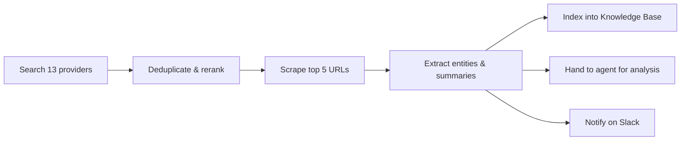

Sometimes the answer is not in your database -- it is on the web. DEHA ONE's Web Intelligence layer gives your agents and pipelines two complementary tools:

- **Search** — fan a query out to 13 providers in parallel and get one deduplicated, re-scored result set
- **Scraping** — fetch any URL and turn it into clean markdown, structured JSON, or LLM-extracted data

<Info>
  Both capabilities are user-scoped, rate-limited, and cached. Costs are charged in credits per call. No browser pool, no proxy management, no per-provider key juggling -- you bring API keys for the providers you want enabled, and DEHA ONE handles the rest.
</Info>

---

## When to use which

| You want to ... | Use ... |
|---|---|
| Find the latest news on a topic | [Search](/web-intel/search) (Tavily, Google News, GDELT) |
| Discover what people are saying on social media or complaint sites | [Search](/web-intel/search) (Twitter, YouTube, Sikayetvar) |
| Pull product pricing or reviews from Google Shopping / Reviews | [Search](/web-intel/search) (SerpAPI) |
| Convert a known URL into clean markdown for your agent to read | [Scraping](/web-intel/scraping) |
| Extract structured fields from a page (title, price, author, date) | [Scraping](/web-intel/scraping) with CSS selectors or LLM extraction |
| Crawl a small batch of URLs (up to 50) and bring back content | [Scraping](/web-intel/scraping) batch mode |
| Monitor a search query for new results on a schedule | [Search](/web-intel/search) + [Scheduling](/automations/scheduling) |

---

## Wired into your workflows

Search and scraping are pipeline step types -- you can chain them with anything:

A common pattern: every morning, search for news mentioning your brand, scrape the relevant articles, summarize them, index into the knowledge base, and post a digest in Slack.

---

## Coverage and constraints

| | Search | Scraping |
|---|---|---|
| **Providers** | 13 web providers (see [Search](/web-intel/search)) | Any HTTP/HTTPS page |
| **Bring your own keys** | Yes -- vaulted per user | n/a |
| **Concurrency** | Parallel provider fan-out (default 5 in-flight) | Chromium pool (default 3 in-flight per worker) |
| **Rate limits** | Per-provider quotas (you control) | Per-domain sliding window |
| **Caching** | 30 minutes default, user-scoped | 1 hour default, user-scoped |
| **Output formats** | Normalized result schema with URL, title, snippet, score, recency | Markdown, CSS-extracted JSON, LLM-extracted JSON |
| **Credits** | 3 per search, 2 per monitor | 2 markdown, 5 CSS, 10 LLM extract |
| **Profile-based** | Provider-specific knobs (e.g., country, language, recency) | Built-in profiles: `news_article`, `blog_post` |

---

## What you do NOT have to manage

- **Browser fleets** — Crawl4AI runs in a managed Chromium pool
- **Captcha / JS-rendering** — handled internally
- **Per-provider quirks** — every search result is normalized into one schema
- **Token bloat** — markdown extraction is on average 67% fewer tokens than raw HTML
- **Stale caches across users** — every cache key is namespaced by user

---

## Next steps

<CardGroup cols={2}>
  <Card title="Search" icon="magnifying-glass" href="/web-intel/search">
    All 13 search providers, when to use each, and how relevance scoring works.
  </Card>
  <Card title="Scraping" icon="spider-web" href="/web-intel/scraping">
    Markdown, CSS, and LLM extraction. Profiles, batch mode, and rate limits.
  </Card>
</CardGroup>
